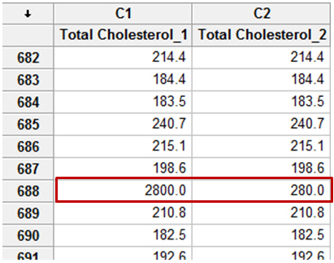
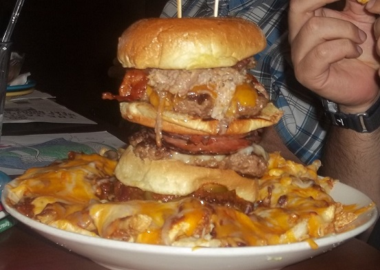

## Strategy

Last time, we used Mark's data to illustrate loading data, some details about variable/object types, basic use of the `reshape2` package, and a few preliminary plots, made with ggplot.

Today, Maya has been nice enough to donate her data to the cause.  We're going to use her data to accomplish our objectives.  Specifically, we're going to

- Clean it up a bit
- Make some plots to discover some relationships
- think about ANOVA

## Material

Practically, we're going to rehash some of the stuff from last time.  As far as R is concerned, I don't think there's anything in here that isn't stuff we didn't cover last time, but feel free to stop me with questions.

## A brief point about outliers

>  - What do I do with my outliers?
>  - A few options:
>     - exclude
>     - ignore
>     - run analyses with and without

>  - As far as I can tell, this seems to be a matter of preference/what your advisor did.

## Outliers

>  - I'm going to argue for a specific approach
>  - Think about *why* that outlier is an outlier

## This?



## Or this?



## Load in Data

In Maya's R script, she first loads in her data:
```{r}
srp <- read.csv('../Data/SR.Past.Rel.12.10.14.csv')
```

After this, she goes on to calculate some index measures and clean the file up a bit.  I've omitted that code here.  However, I'll highlight one thing she did

```{r, echo=FALSE, message=FALSE}
#### EXCLUSIONS ####
#exclude 5 who copied the Michael text verbatim (exclcopied=1)
srp <- srp[ which(is.na(srp$exclcopied) == TRUE ), ]
#exclude 11 who used 'Michael' in their message (didn't follow directions) (exclmich=1)
srp <- srp[ which(is.na(srp$exclmich) == TRUE ), ]

####### COMPUTING VARIABLES ##########
attach(srp)
## rmq
srp$loc <- (rmq_1 + rmq_3 + rmq_4 + rmq_5 + rmq_8 + rmq_16 + rmq_21 + 
              rmq_25 + rmq_28 + rmq_29 + (7-rmq_13) + (7-rmq_24))/12
srp$ass <- ((7-rmq_2) + rmq_6 + rmq_7 + rmq_9 + (7-rmq_10) + rmq_11 + 
              rmq_15 + rmq_19 + rmq_20 + rmq_22 + (7-rmq_27) + rmq_30)/12
srp$locomassess = srp$loc-srp$ass

srp$prom = (6-rfq_1) + rfq_3 + rfq_7 + (6-rfq_9) + rfq_10 + (6-rfq_11)
srp$prev = (6-rfq_2) + (6-rfq_4) + rfq_5 + (6-rfq_6) + (6-rfq_8)
srp$prommprev = srp$prom-srp$prev

# closeness measure
srp$closeness <- (((8-close_1) + (8-close_2) + close_3 + close_4 + 
                     (8-close_5) + (8-close_6) + close_7 + close_8)/8)

# ntoBelong
srp$belong = ((6-NTB_1) + (6-NTB_3) + (6-NTB_7) + NTB_2 + NTB_4 + 
                NTB_5 + NTB_6 + NTB_8 + NTB_9 + NTB_10)/10

# Relational Trust
srp$reltrust = (reltrust_1 + reltrust_2 + reltrust_3 + reltrust_4)/4

# Epistemic Trust
srp$epistrust = (epistrust_1 + epistrust_2 + epistrust_3 + epistrust_4)/4

# message trust
srp$messtrust = (messtrust_1 + messtrust_2 + messtrust_3 + messtrust_4)/4

# ECR
srp$anx = (ECR.S_2 + ECR.S_4 + ECR.S_6 + (8-ECR.S_8) + ECR.S_10 + ECR.S_12)
srp$avoid = ((8-ECR.S_1) + ECR.S_3 + (8-ECR.S_5) + ECR.S_7 + ECR.S_9 + ECR.S_11)

#SCS
srp$independence = (((8-SCS_1) + (8-SCS_2) + (8-SCS_3) + (8-SCS_4) + 
                       (8-SCS_5) + (8-SCS_6) + (8-SCS_7) + (8-SCS_8) + 
                       (8-SCS_9) + (8-SCS_10) + (8-SCS_11) + (8-SCS_12) + 
                       SCS_13 + SCS_14 + SCS_15 + SCS_16 + SCS_17 + SCS_18 + 
                       SCS_19 + SCS_20 + SCS_21 + SCS_22 + SCS_23 + SCS_24)/24)

detach(srp)

#F-Scale
srp$authority = (((srp$F.Scale_1) + (srp$F.Scale_2) + (srp$F.Scale_3) + 
                    (srp$F.Scale_4) + (srp$F.Scale_5) + (srp$F.Scale_6) + 
                    (srp$F.Scale_7) + (srp$F.Scale_8) + (srp$F.Scale_9) + 
                    (srp$F.Scale_10) + (srp$F.Scale_11) + (srp$F.Scale_12) + 
                    srp$F.Scale_13 + srp$F.Scale_14 + srp$F.Scale_15 + 
                    srp$F.Scale_16 + srp$F.Scale_17 + srp$F.Scale_18 + 
                    srp$F.Scale_19 + srp$F.Scale_20 + srp$F.Scale_21 + 
                    srp$F.Scale_22)/22)


#### RECODING ####

####renaming manipulations 
#install.packages("reshape")
library(reshape)
library(reshape)
srp <- rename(srp, c(DO.BR.FL_19="relprime")) #dissolved=1, stable=2
srp <- rename(srp, c(DO.BR.FL_20="attitude")) #like=2, dislike=1
```


## Dummy coding manipulations

```{r}
srp$relprimedum[srp$relprime == "Stable Relationship Priming"] <- 0
srp$relprimedum[srp$relprime == "Dissolved Relationship Priming"] <- 1

srp$attitudedum[srp$attitude == "Michael-Dislike"] <- 0
srp$attitudedum[srp$attitude == "Michael-Like"] <- 1
```

Here, we're making a new variable which is a dummy code of another variable (i.e. code the two categories as 1 and zero).  Let's look a little more closely at what's going on here.

## Dummy coding manipulations

```{r, eval=FALSE}
srp$relprimedum[srp$relprime == "Stable Relationship Priming"] <- 0
srp$relprimedum[srp$relprime == "Dissolved Relationship Priming"] <- 1
```


> - We select the dataframe 

> - `srp` 

> - We indicate the column we want within that dataframe 

> - `srp$relprimedum` 

## Dummy coding manipulations

```{r, eval=FALSE}
srp$relprimedum[srp$relprime == "Stable Relationship Priming"] <- 0
srp$relprimedum[srp$relprime == "Dissolved Relationship Priming"] <- 1
```

`srp$relprimedum` is a column that didn't exist before, so when we do this, we are telling R to create a new variable with that name.


## Dummy coding manipulations

```{r, eval=FALSE}
srp$relprimedum[srp$relprime == "Stable Relationship Priming"] <- 0
srp$relprimedum[srp$relprime == "Dissolved Relationship Priming"] <- 1
```
So, new variable.  What now?

> - Fill it in with zeros! 

> - `srp$relprimedum ... <- 0`

## Dummy coding manipulations

```{r, eval=FALSE}
srp$relprimedum[srp$relprime == "Stable Relationship Priming"] <- 0
srp$relprimedum[srp$relprime == "Dissolved Relationship Priming"] <- 1
```
But there's other stuff present, right?  What's it doing?

`srp$relprimedum ... <- 0`

> - If we just ran the following, we would have a long vector of zeros

> - `srp$relprimedum <- 0`

## Dummy coding manipulations

```{r, eval=FALSE}
srp$relprimedum[srp$relprime == "Stable Relationship Priming"] <- 0
srp$relprimedum[srp$relprime == "Dissolved Relationship Priming"] <- 1
```
But zeros aren't that useful to us.  We want zeros and ones.  Specifically,  we want zeros for people who had stable relationship primes, and ones for those who had dissolved relationship priming.

This is what the bit in brackets is doing

> - `srp$relprime == "Stable Relationship Priming"`

> - This returns a bunch of `TRUE` and `FALSE` values.

> - When we plug these *boolean* values into the rows of the new variable that we're assigning values to (using bracket notation), it will only assign values to those that take a value of `TRUE`. 

## Subset & Plot

But is this process really necessary?  After this, Maya goes on to create subsets of her data so that she can plot them, like this:

```{r}
###### SUBSETTING ####
srlike <- subset(srp, attitudedum==1)
srdislike <- subset(srp, attitudedum==0)
srstable <- subset(srp, relprimedum==0)
srdissolve <- subset(srp, relprimedum==1)
```

## Subset & Plot

But is this process really necessary?  After this, Maya goes on to create subsets of her data so that she can plot them, like this:

```{r, echo=FALSE}
library(ggplot2)
theme_set(theme_bw(base_size = 14)) #for all graphs to have bw background & same font size
```

```{r, fig.align='center', fig.height=3.5}
ggplot(srlike, aes(x=vmessage)) + 
  geom_density()
```


## Subset & Plot

And then:

```{r, fig.align='center', fig.height=3.5}
ggplot(srdislike, aes(x=vmessage)) + 
  geom_density()
```

## Subset & Plot
Why do we plot?  To answer questions about the data..

> - Normally distributed? 
>     - Basically.
> - Difference between like & dislike? 
>     - Hard to tell...


## Subset & Plot
We can kill three birds with one stone here by:

1.  Just using the original variable (stored as a factor)

2.  Omitting the subsetting step

3.  Putting both conditions on the same plot

```{r}
str(srp$attitude)
```

R handles factors pretty intelligently.  We might have to fiddle with them on occasion, but in this case, it should work fine.

## Subset & Plot
```{r}
plot <- ggplot(srp, aes(x=vmessage, color=attitude))
plot + geom_density()
```

## More Plotting

What we're doing is examining the influence of two separate IV's on two DV's.  So, although we could make four plots like the one above (one for combination of IV & DV), we can simplify this even *more* by putting both IVs on the same plot.

## More Plotting
For the vRecall DV:
```{r, fig.height=4}
plot <- ggplot(srp, aes(x=vrecall, color=attitude))
plot + geom_density() + facet_wrap(~relprime)
```

## More Plotting
For the vMessage DV:
```{r, fig.height=4}
plot <- ggplot(srp, aes(x=vmessage, color=attitude))
plot + geom_density() + facet_wrap(~relprime)
```

## More Plotting
```{r, fig.height=3}
plot <- ggplot(srp, aes(x=vmessage, color=attitude))
plot + geom_density() + facet_wrap(~relprime)
```

The utitity of plotting shows itself!  That spike for dissolved priming certainly looks a little odd, don't you think?  Let's just make sure there's nothing weird about the data...

## Check the data {.smaller}
We can print out a nice table of the values:

```{r}
with(srp[srp$relprime == 'Dissolved Relationship Priming',], 
     table(vmessage, attitude))
```

## Check the data
So we saw that nine people selected the .5 option for that group.  This is certainly a lot, but I don't feel like it suggests that anything fishy is going on.

## Check the data
In Maya's original script, we next examined a correlation coefficient for the relationship between vrecall and vmessage

>  - Why?
>      - Presumably, because we're interested in the relationship


## Check the data {.smaller}

```{r}
cor.test(srstable$vmessage, srstable$vrecall) 
```

## Check the data {.smaller}

```{r}
cor.test(srdissolve$vmessage, srdissolve$vrecall) 
```

## Check the data

>  - What do we know?
>      - The data are significantly correlated.
>  - What do we not know?
>      - The nature of the correlation (i.e. what is the relationship?)

## Check the data {.smaller}

```{r fig.width=5, fig.height=4, warning=FALSE, fig.align='center', echo=FALSE}
library(png)
library(grid)
img <- readPNG('../Images/Anscombe.png')
grid.raster(img)
```

>  - All four datasets have the same correlation.
>  - If we want to know about the relationship, we need to look at the data

## Check the data {.smaller}

Clear, strong, and positive relationship.  No funny business.
```{r, fig.height=3.5}
plot <- ggplot(srp, aes(x=vmessage, y=vrecall))
plot + geom_point(position=position_jitter())
```

Does this relationship differ by condition?

## Check the data {.smaller}

```{r, fig.height=3.5, fig.width=6}
plot <- ggplot(srp, aes(x=vmessage, y=vrecall))
plot + geom_point(position=position_jitter()) + facet_grid(attitude~relprime)
```

No difference in relationship, but there might be something else....

## Testing for inference with ANOVA {.smaller}

At this point, Maya computes a series of ANOVAs.  For example:
```{r}
## ONE-WAY ANOVAS: main effects
sr.att.mess <- aov(vmessage ~ attitudedum, data=srp)
summary(sr.att.mess) #main effect of attitude

sr.rel.mess <- aov(vmessage ~ relprimedum, data=srp)
summary(sr.rel.mess) #ns
```

## Testing for inference with ANOVA {.smaller}
```{r}
sr.rel.att.mess <- aov(vmessage ~ attitudedum * relprimedum, data=srp)
summary(sr.rel.att.mess) #main effect of attitude (interaction ns)
```

## Testing for inference with ANOVA

>  - This is one area where R simultaneously shines and is immensely frustrating to new users.
>  - Shines?
>      - Extremely flexible.
>      - You become intimately acquainted with precisely what you're doing with an ANOVA
>  - Frustrating
>      - You can't really 'plug and play'
>      - Easier to do something other than what you want (sometimes without realizing!)

## Testing for inference with ANOVA

Should the results of these two differ?

```{r}
m.1<-aov(vmessage ~ attitudedum * relprimedum, data=srp)
m.2<-aov(vmessage ~ relprimedum * attitudedum, data=srp)
```

## Testing for inference with ANOVA {.smaller}

Ah, but they do!
```{r}
summary(m.1)
summary(m.2)
```

##  ANOVA

Taking a step back, what are we doing with ANOVAs?

>  - **Anova** - **AN**alysis **O**f **VA**riance.
>      - Take some observed variability and analyze where it comes from.

>  - We have variability in `vmessage` - the valence of a message about *Micheal* participants sent to someone named *Sam*.
>  - Tory Higgins' "saying is believing" paradigm

##  ANOVA

>  - Where does the variability in `vmessage` come from?
>  - Partly from chance variation between people
>  - Partly because we've set up an experiment designed to induce variation.
>      - Some participants think that *Sam* likes *Michael*.  Others think (s)he doesn't.
>      - Some participants have been primed to think of a recently ended relationship.  Others were primed to think of an ongoing relationship.
>  - How much comes of the variability comes from chance, and how much from our manipulations?  And, between our manipulations, how much comes from manipulation of attitude vs. manipulation of relationship prime?

##  ANOVA

>  - This way of framing makes it seem like our manipulations are independent of each other.
>      - In other words, there's no relationship between our manipulation of attitude and our manipulation of the prime.
>          - if we could compute a correlation between our independent variables, it would be exactly zero!
>  - Surely this is what we meant to do.  But is it what we have *actually done*?
>  - Turns out, we can compute a correlation coefficient!

## ANOVA {.smaller}
1.  Assign numeric values to attitude and prime (for the sake of illustration) via `as.numeric()`
2.  Put these values into a new dataframe called `temp` and look at the first few rows with `head()`.
```{r}
temp <- data.frame(subj=srp$subj, attitude=as.numeric(srp$attitude), 
                   prime=as.numeric(srp$relprime))
head(temp)
```

>  - What's the correlation?
>  - ! 0
>  - that was a little programming joke....

##  ANOVA

```{r}
cor(as.numeric(srp$attitude), as.numeric(srp$relprime))
```

Close, but no cigar...

##  ANOVA & balance

This means we have what is commonly referred to as an 'unbalanced design'.

We have different numbers of observations in each of our 4 experimental cells.

Why would this matter?

##  This is the observed variability {.smaller}

```{r, echo=FALSE, fig.height=4, fig.width=5, fig.align='center'}
img <- readPNG('../Images/Var.png')
grid.raster(img)
```

>  - If our two variables are completely independent (i.e. uncorrelated) then they would each explain a unique portion of this observed variability

##  Our imaginary uncorrelated manipulations {.smaller}
```{r, echo=FALSE, fig.height=4, fig.width=5, fig.align='center'}
library(png)
library(grid)
img <- readPNG('../Images/indep.png')
grid.raster(img)
```

>  - However, our two manipulations *aren't* inependent.  They're related to each other, so we get something different

##  Our actual, correlated manipulations {.smaller}
```{r, echo=FALSE, fig.height=4, fig.width=5, fig.align='center'}
library(png)
library(grid)
img <- readPNG('../Images/Cor.png')
grid.raster(img)
```

>  - With regards to ANOVA, this means that we know that our experiment is responsible for all the variance taken up by the circles.
>  - The difficulty lies in the middle bit.  Which variable is it part of?

## Unbalanced Anovas

>  - We've inadvertently set up a situation in which our manipulations are fighting to explain the same piece of the variance lasagna.
>  - The question of what to do with this shared piece is answered by how we choose to allocate our Sums of squares.
>  - 3 types
>      - Type I SS ('sequential')
>      - Type II SS ('heirarchical')
>      - Type III SS ('marginal')

## Type I SS

>  - Breaks up the estimation sequentially
>      1. SS(Prime)
>      2. SS(Attitude | Prime)
>      3. SS(Prime * Attitude | Prime, Attitude)

>  - Let's visualize this

## Step One: get the variance associated with Prime

```{r, echo=FALSE, fig.align='center', fig.height=4, fig.width=5} 
source('../..//colorfulVennPlot/R/plotVenn3d.R')  #load in my modified version
plotVenn3d(c(10, 10, 10, 10, 10, 10, 10), 
                  labels = c('Prime*Attitude', 'Attitude', 'Prime'), 
                  Colors = c('#144256', rep('White', 2), rep('#144256', 2),
                             'White', '#144256'), 
                  printvals=F)
```

## Step Two: Get the remaining bit of Attitude

```{r, echo=FALSE, fig.align='center', fig.height=4, fig.width=5}
plotVenn3d(c(10, 10, 10, 10, 10, 10, 10), 
                  labels = c('Prime*Attitude', 'Attitude', 'Prime'), 
                  Colors = c('#144256', rep('#88301B', 2), rep('#144256', 2),
                             'White', '#144256'), printvals=F)
```

## Step Three: Take the remaining variance left in the interaction term

```{r, echo=FALSE, fig.align='center', fig.height=4, fig.width=5}
plotVenn3d(c(10, 10, 10, 10, 10, 10, 10), 
                  labels = c('Prime*Attitude', 'Attitude', 'Prime'), 
                  Colors = c('#144256', rep('#88301B', 2), rep('#144256', 2), 
                             '#88691B', '#144256'), printvals=F)
```

## Type I in R

>  - When we use `aov` with the default values, we are computing a type I SS
>  - We can see this by switching the order in which we enter our terms

```{r}
sr.rel.att.mess1 <- aov(vmessage ~ attitude * relprime, data=srp)
sr.rel.att.mess2 <- aov(vmessage ~ relprime * attitude, data=srp)
```


## Type I in R {.smaller}

```{r}
summary(sr.rel.att.mess1)
summary(sr.rel.att.mess2)
```

##Type II SS

>  - Accounts for independent contribution of variables, but *ignores interactions*
>      1. SS(Prime | Attitude)
>      2. SS(Attitude | Prime)
>      3. SS(Prime * Attitude | Prime, Attitude)

## Step One:  Get the variance associated with Prime, independent of Attitude

```{r, echo=FALSE, fig.align='center', fig.height=4, fig.width=5}
plotVenn3d(c(10, 10, 10, 10, 10, 10, 10), 
                  labels = c('Prime*Attitude', 'Attitude', 'Prime'), 
                  Colors = c('#144256', rep('White', 2), '#144256', rep('White', 3) ), printvals=F)
```

## Step Two:  Get the variance associated with Attitude, independent of Prime

```{r, echo=FALSE, fig.align='center', fig.height=4, fig.width=5}
plotVenn3d(c(10, 10, 10, 10, 10, 10, 10), 
                  labels = c('Prime*Attitude', 'Attitude', 'Prime'), 
                  Colors = c('#144256', rep('#88301B', 2), '#144256', rep('White', 3) ), printvals=F)
```

## Step Three:  Variance for the interaction, less that from main effects

```{r, echo=FALSE, fig.align='center', fig.height=4, fig.width=5}
plotVenn3d(c(10, 10, 10, 10, 10, 10, 10), 
                  labels = c('Prime*Attitude', 'Attitude', 'Prime'), 
                  Colors = c('#144256', rep('#88301B', 2), '#144256', 'White', 
                             '#88691B', 'White'), printvals=F)
```

## Type II:

>  - Increased power to detect main effects
>  - You're kind of saying that the interaction isn't important (area which could be used to estimate interaction is instead used to estimate the main effects)
>      - (If that's true, why are you modeling the interaction in the first place?)

## Type II in R

Take advantage of the `Anova` function from the `car` package

```{r}
library(car)
sr.rel.att.mess <- aov(vmessage ~ attitude * relprime, data=srp)
a.sr<-Anova(sr.rel.att.mess, type=2)
```

## Type II in R

Note that the numbers for the two main effects are the same as if we had taken the estimates in step two from each of the type I anovas.

```{r}
a.sr
```

## Type III SS

>  - Historically, the most commonly used in psych
>  - The best fit with our usual hypotheses
>      - 'Holding all other variables constant, is there an effect of Prime?'
>      1. SS(Prime | Attitude, Prime * Attitude)
>      2. SS(Attitude | Prime, Prime * Attitude)
>      3. SS(Prime * Attitude | Prime, Attitude)
> - We're now interested in *unique* variance

## Step One:  Get the variance uniquely associated with Prime

```{r, echo=FALSE, fig.align='center', fig.height=4, fig.width=5}
plotVenn3d(c(10, 10, 10, 10, 10, 10, 10), 
                  labels = c('Prime*Attitude', 'Attitude', 'Prime'), 
                  Colors = c(rep('White', 3), '#144256', rep('White', 3) ), 
                  printvals=F)
```

## Step Two:  Get the variance uniquely associated with Attitude

```{r, echo=FALSE, fig.align='center', fig.height=4, fig.width=5}
plotVenn3d(c(10, 10, 10, 10, 10, 10, 10), 
                  labels = c('Prime*Attitude', 'Attitude', 'Prime'), 
                  Colors = c(rep('White', 2), '#88301B', '#144256',
                             rep('White', 3)), printvals=F)
```

## Step Three:  Get the variance uniquely associated with the Prime*Attitude interaction

```{r, echo=FALSE, fig.align='center', fig.height=4, fig.width=5}
plotVenn3d(c(10, 10, 10, 10, 10, 10, 10), 
                  labels = c('Prime*Attitude', 'Attitude', 'Prime'), 
                  Colors = c(rep('White', 2), '#88301B', '#144256',
                             'White', '#88691B', 'White'), printvals=F)
```

## Type III:

>  - Conservative
>      - Not likely to say that there's a main effect of A when there's actually a main effect of B
>      - Not likely to say that there's a main effect of A or B when there's really an interaction of A * B

## Illustration {.smaller}

```{r, echo=FALSE, fig.align='center', fig.height=4, fig.width=5}
y<-c(2, 2, 3, 8) #fake means
x<-c('A', 'B', 'A', 'B') # IV 1
z<-c('C', 'C', 'D', 'D') # IV 2
df.plot<-data.frame(x, y, z) # put them in a data frame
plot <- ggplot(df.plot, aes(x=x, y=y, group=z, color=z))
  plot + geom_point(size=7)+
  geom_line()
```

>  - This is clearly an interaction (x influences y, but only for category D)
>  - Type II would bias us toward finding a main effect instead of an interaction
>      - i.e. Y is higher for category B than category A
>      - note that this is *true*, but is not really an accurate description of the data

## Type III in R

>  - One additional step in comparison to type II
>  - As previously pointed out, we typically don't worry too much about factors, as R does the dirty work of creating contrasts for us.
>  - There are a number of ways to create contrasts.
>  - By default, R creates contrasts using one of two functions

## Type III in R

```{r}
getOption('contrasts')
```

## Type III in R {.smaller}

```{r}
with(srp, contrasts(attitude))
with(srp, contrasts(relprime))
```

A straightforward dummy coding.  This is great for regression, but a type III ANOVA demands effects coding (i.e. make sure they sum to zero).

## Type III in R

```{r}
# feed contrast TWO values -  one for unordered and one for 
# ordered factors
options(contrasts=c('contr.sum', 'contr.poly')) 
with(srp, contrasts(relprime))
```

Then we can proceed almost just the same as a type II, but specifying that we want type III

## Type III in R

```{r}
sr.rel.att.mess <- aov(vmessage ~ attitude * relprime, data=srp)
a.sr<-Anova(sr.rel.att.mess, type=3)
a.sr
```

## One final note

All of this business about different SS is only applicable to occasions when you have a different number of observations in your experimental cells.  If you've got balanced data, then you'll get the same answer regardless of which type you use.

## Recap

>  - **Look at your data!**
>  - 3 flavors of sums of squares
>      - Type I is sequential.  Estimates depend on the order in which you enter the terms
>      - Type II is biased toward detecting main effects at the expense of interactions
>      - Type III does not have the bias present in type II, but has the least power of any of them.