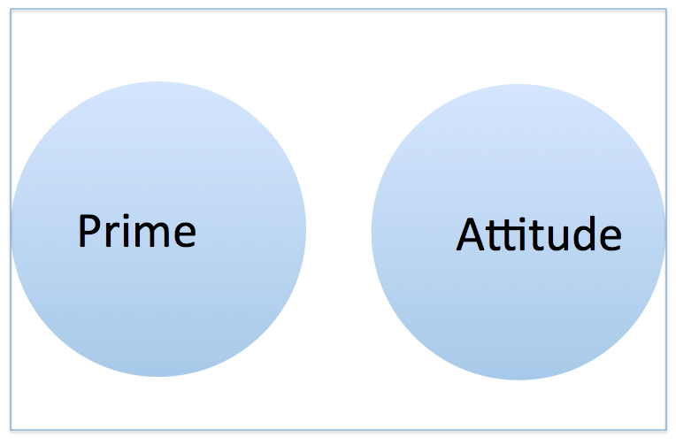

```{r, warning=FALSE, message=FALSE, echo=FALSE}
srp <- read.csv('../Data/SR.Past.Rel.12.10.14.csv')
#### EXCLUSIONS ####
#exclude 5 who copied the Michael text verbatim (exclcopied=1)
srp <- srp[ which(is.na(srp$exclcopied) == TRUE ), ]
#exclude 11 who used 'Michael' in their message (didn't follow directions) (exclmich=1)
srp <- srp[ which(is.na(srp$exclmich) == TRUE ), ]

####### COMPUTING VARIABLES ##########
attach(srp)
## rmq
srp$loc <- (rmq_1 + rmq_3 + rmq_4 + rmq_5 + rmq_8 + rmq_16 + rmq_21 + 
              rmq_25 + rmq_28 + rmq_29 + (7-rmq_13) + (7-rmq_24))/12
srp$ass <- ((7-rmq_2) + rmq_6 + rmq_7 + rmq_9 + (7-rmq_10) + rmq_11 + 
              rmq_15 + rmq_19 + rmq_20 + rmq_22 + (7-rmq_27) + rmq_30)/12
srp$locomassess = srp$loc-srp$ass

srp$prom = (6-rfq_1) + rfq_3 + rfq_7 + (6-rfq_9) + rfq_10 + (6-rfq_11)
srp$prev = (6-rfq_2) + (6-rfq_4) + rfq_5 + (6-rfq_6) + (6-rfq_8)
srp$prommprev = srp$prom-srp$prev

# closeness measure
srp$closeness <- (((8-close_1) + (8-close_2) + close_3 + close_4 + 
                     (8-close_5) + (8-close_6) + close_7 + close_8)/8)

# ntoBelong
srp$belong = ((6-NTB_1) + (6-NTB_3) + (6-NTB_7) + NTB_2 + NTB_4 + 
                NTB_5 + NTB_6 + NTB_8 + NTB_9 + NTB_10)/10

# Relational Trust
srp$reltrust = (reltrust_1 + reltrust_2 + reltrust_3 + reltrust_4)/4

# Epistemic Trust
srp$epistrust = (epistrust_1 + epistrust_2 + epistrust_3 + epistrust_4)/4

# message trust
srp$messtrust = (messtrust_1 + messtrust_2 + messtrust_3 + messtrust_4)/4

# ECR
srp$anx = (ECR.S_2 + ECR.S_4 + ECR.S_6 + (8-ECR.S_8) + ECR.S_10 + ECR.S_12)
srp$avoid = ((8-ECR.S_1) + ECR.S_3 + (8-ECR.S_5) + ECR.S_7 + ECR.S_9 + ECR.S_11)

#SCS
srp$independence = (((8-SCS_1) + (8-SCS_2) + (8-SCS_3) + (8-SCS_4) + 
                       (8-SCS_5) + (8-SCS_6) + (8-SCS_7) + (8-SCS_8) + 
                       (8-SCS_9) + (8-SCS_10) + (8-SCS_11) + (8-SCS_12) + 
                       SCS_13 + SCS_14 + SCS_15 + SCS_16 + SCS_17 + SCS_18 + 
                       SCS_19 + SCS_20 + SCS_21 + SCS_22 + SCS_23 + SCS_24)/24)

detach(srp)

#F-Scale
srp$authority = (((srp$F.Scale_1) + (srp$F.Scale_2) + (srp$F.Scale_3) + 
                    (srp$F.Scale_4) + (srp$F.Scale_5) + (srp$F.Scale_6) + 
                    (srp$F.Scale_7) + (srp$F.Scale_8) + (srp$F.Scale_9) + 
                    (srp$F.Scale_10) + (srp$F.Scale_11) + (srp$F.Scale_12) + 
                    srp$F.Scale_13 + srp$F.Scale_14 + srp$F.Scale_15 + 
                    srp$F.Scale_16 + srp$F.Scale_17 + srp$F.Scale_18 + 
                    srp$F.Scale_19 + srp$F.Scale_20 + srp$F.Scale_21 + 
                    srp$F.Scale_22)/22)


#### RECODING ####

####renaming manipulations 
#install.packages("reshape")
library(reshape)
library(reshape)
srp <- rename(srp, c(DO.BR.FL_19="relprime")) #dissolved=1, stable=2
srp <- rename(srp, c(DO.BR.FL_20="attitude")) #like=2, dislike=1

```
Recall last time we looked at some data Maya had donated.  It came from a saying-is-believing experiment in which individuals were told to communicate some information about Michael to someone named Sam.  Prior to this communication, participants were primed to recall a dissolved relationship or a stable, ongoing relationship.  Further, some people believe that Sam likes Michael, while others believe that Sam does not like Michael.

We've got two measures of interest - first, what is the valence of the message that participants produce (e.g., was it positive or negative?).  Second, participants were later asked to recall some information about Michael.  What is the valence of this later recalled information?

We ended last time with looking at this plot, which I think nicely summarizes our questions above.

```{r}
library(ggplot2)
ggplot(srp, aes(x=vmessage, y=vrecall)) + 
  geom_point(position=position_jitter()) + facet_grid(attitude~relprime) +
  theme_bw()
```

To summarize what went on there, we created a ggplot object using the srp data, and specified the default mapping with `aes(x=vmessage, y=vrecall)`.  To that, we added a layer - a geometric object, or "geom".  There are many geoms - bars, lines, points, text, etc.  For the current plot, we wanted dots.  This means that a dot will be drawn for each of our observations.  It will land in the location dictated by our default x and y variables (vmessage and vrecall).

We've adjusted this with another specification - the facet (sometimes called conditioned or trellis plots).  This is a good way to explore data on a conditional basis.  Facet simply splits up what we've already created by the value of some other variable(s).  

Finally, I've applied a black and white theme to the plot.  Otherwise we have the distinctive ggplot grey background.  Not that it's bad, I just prefer the black and white.  Here's the same plot, but with a more verbose version of the syntax.  I think it helps to see what is going on under the hood:

```{r, eval=FALSE}
ggplot() + #create plot object
  layer(
    #specify data & what goes where
    data=srp, mapping=aes(x=vmessage,y=vrecall),
    #display raw data with jittered points
    geom='point', stat='identity', position=position_jitter()
    ) +
  #facet that mofo by attitude & relprime
  facet_grid(attitude~relprime) + 
  theme_bw() #make it black and white
```

While we're on the subject, there are other fun themes we can use.  For instance:

```{r, warning=FALSE}
library(ggthemes) #this package contains lots of good ones
ggplot(srp, aes(x=vmessage, y=vrecall)) + 
  geom_point(position=position_jitter()) + facet_grid(attitude~relprime) +
  theme_economist()
```

I dislike the removal of the lines separating the facets, but if it isn't faceted, it could look alright.

```{r}
ggplot(srp, aes(x=vmessage, y=vrecall)) + 
  geom_point(position=position_jitter()) + facet_grid(attitude~relprime) +
  theme_excel()
```

Just in case you miss making awful excel plots.

```{r}
ggplot(srp, aes(x=vmessage, y=vrecall)) + 
  geom_point(position=position_jitter()) + facet_grid(attitude~relprime) +
  theme_fivethirtyeight()
```

Anyone want to work for Nate Silver?

```{r}
ggplot(srp, aes(x=vmessage, y=vrecall)) + 
  geom_point(position=position_jitter()) + facet_grid(attitude~relprime) +
  theme_stata()
```

Impress your stata friends.

```{r}
ggplot(srp, aes(x=vmessage, y=vrecall)) + 
  geom_point(position=position_jitter()) + facet_grid(attitude~relprime) +
  theme_wsj()
```

How about working for Rupert Murdoch?

```{r, warning=FALSE, message=FALSE}
# to get this one to work requires a few more steps..
# see here:  http://epijim.uk/code/xkcd/
library(xkcd) 
ggplot(srp, aes(x=vmessage, y=vrecall)) + 
  geom_point(position=position_jitter()) + facet_grid(attitude~relprime) +
  theme_xkcd()
```

Oh god, I can't even stand how cool.  Look what else

```{r, warning=FALSE, message=FALSE}
mapping <- aes(x,  y,
                  scale,
                  ratioxy,
                  angleofspine ,
                  anglerighthumerus,
                  anglelefthumerus,
                  anglerightradius,
                  angleleftradius,
                  anglerightleg,
                  angleleftleg,
                  angleofneck)

dataman <- data.frame( x= 2.5, y=-4.5,
                         scale = 0.5,
                         ratioxy = 1,
                         angleofspine =  -pi/2  ,
                         anglerighthumerus = pi/1.1,
                         anglelefthumerus = -pi/5,
                         anglerightradius = pi/1.75,
                         angleleftradius = -pi/1.75,
                         angleleftleg = 3*pi/2  + pi / 12 ,
                         anglerightleg = 3*pi/2  - pi / 12,
                         angleofneck = runif(1, 3*pi/2-pi/10, 3*pi/2+pi/10))

ggplot(srp, aes(x=vmessage, y=vrecall)) + 
  geom_point(position=position_jitter()) + #facet_grid(attitude~relprime) +
  theme_xkcd() + 
  xkcdman(mapping, dataman) + 
  annotate('text', x=2, y=-3, label="Hi, I'm Sam.\n  That Micheal is kind of\n an asshole, don't you think?", family='xkcd')
```

*Awesome.*  

Okay, let's get down to brass tacks.  We've already examined our data in detail and we suspect that our manipulation of Sam's attitude has had an effect on the valence of our participant's message as well as what they recall.  Is this true?  To answer this question, Maya (correctly) decided that an ANOVA framework is appropriate

```{r, eval=FALSE}
## ONE-WAY ANOVAS: main effects
sr.att.mess <- aov(vmessage ~ attitudedum, data=srp)
summary(sr.att.mess) #main effect of attitude

sr.att.rec <- aov(vrecall ~ attitudedum, data=srp)
summary(sr.att.rec) #main effect of attitude

sr.rel.mess <- aov(vmessage ~ relprimedum, data=srp)
summary(sr.rel.mess) #ns

sr.rel.rec <- aov(vrecall ~ relprimedum, data=srp)
summary(sr.rel.rec) #ns

## TWO-WAY ANOVAS: interactions
sr.rel.att.mess <- aov(vmessage ~ attitudedum * relprimedum, data=srp)
summary(sr.rel.att.mess) #main effect of attitude (interaction ns)

sr.rel.att.rec <- aov(vrecall ~ attitudedum * relprimedum, data=srp)
summary(sr.rel.att.rec) #main effect of attitude (interaction ns)
```

This is gonna get ugly.  It's time to consider what we're doing here, and how to specify it.  So, what is an ANOVA?

###ANOVA
It stands for Analysis Of VAriance.  That is, we're taking some observed variability, and figuring out where it comes from.  For simplicity, let's focus on `vmessage`.  It should be obvious that participants will generate messages which are not exactly equally valenced.  Indeed, we've already seen this in some of the plots we've made.  What we'd like to know is where this variability comes from.  

We've set up an experiment in which we think that two manipulations will induce some variance.  Specifically, we've made it such that some participants think that Sam likes Michael, and others think that Sam dislikes Michael.  We've also primed some people to think of either a recently ended relationship or a relationship that is ongoing.  How much of the variability in `vmessage` is due to the contribution of these two manipulations?

We're thinking of these two variables as completely independent from each other.  That is, if we could compute a correlation coefficient between them, it would be exactly zero.  It turns out, we *can* compute a correlation coefficient!  Look at the data:

```{r}
temp <- data.frame(subj=srp$subj, attitude=as.numeric(srp$attitude), 
                   prime=as.numeric(srp$relprime))
head(temp)
```


We've assigned numeric values to attitude and prime (for the sake of illustration) via `as.numeric()`.  We then put them in a new dataframe called `temp` and looked at the first few rows with `head()`.  What's the correlation between them?  Well, it isn't zero.  

```{r}
cor(temp$attitude, temp$prime)
```


It's `r round(cor(as.numeric(srp$attitude), as.numeric(srp$relprime)), 5)`.  I know, I know.  *Almost*, right?  Well, almost isn't good enough.  We need zero on the dot.  To think of this in a different, perhaps more intuitive way:

```{r}
table(srp$attitude, srp$relprime)
```

This displays the number of observations we've got in each cell.  Note that they're not the same.  This is sometimes called *unbalanced data*.  When your data are unbalanced, mathematically this means that your IVs are correlated with each other.

Why does this matter?  Remember that we're trying to explain the variability in `vmessage`.  We'd like to attribute some of that variability to attitude and some to the prime.  Visually, the variability is usually depicted as a geometric box.


If our two variabiles were totally independent, then we could imagine that they each explain some unique portion of that variance.



However, we know that our two variables are *not* independent.  They are related to each other.  Knowing that someone is in the Michael-Dislike condition tells us some information about whether they're likely to be in the dissolved or stable priming condition.  If our variables were independent, this wouldn't be so.  At any rate, this means our situation looks a little more like this:


What this means for our ANOVA is that we need to figure out how to explain all the variance in our box which is taken up by circles.  In particular, what are we to do with the middle bit?  Is it part of Prime?  Part of attitude?  Part of both?  Neither?  We've inadvertently set up a situation in which our two explanatory variables will be fighting to explain the same piece of variance.

The answer to the question of what to do about the overlapping bit is determined by which Sum of Squares (SS) we select, of which there are three basic types [^1].

#### Type I SS
Type I SS breaks up the estimates sequentially:

1.  SS(Prime)
2.  SS(Attitude | Prime)
3.  SS(Prime*Attitude | Prime, Attitude)

In other words, we get all the variance explained by Prime in step 1, then the variance associated with Attitude after we've taken out the .00071 chunk in step 2, and finally, the variance associated with the interaction, after removing Prime and Attitude in step 3.  Below, I've included the interaction term.  I left it out above for pedagogical reasons, but it works in the same way.

To visualize, in step one, we get all the variance associated with Prime:

```{r, message=FALSE}
# Note I'm using a modified version of the colorfulVennPlot package.
# The modified package can be found on my github page.
source('../..//colorfulVennPlot/R/plotVenn3d.R')
plotVenn3d(c(10, 10, 10, 10, 10, 10, 10), 
                  labels = c('Prime*Attitude', 'Attitude', 'Prime'), 
                  Colors = c('#144256', rep('White', 2), rep('#144256', 2),
                             'White', '#144256'), 
                  printvals=F)
```


Then, step two, we take the remaining bit of Attitude:

```{r}
plotVenn3d(c(10, 10, 10, 10, 10, 10, 10), 
                  labels = c('Prime*Attitude', 'Attitude', 'Prime'), 
                  Colors = c('#144256', rep('#88301B', 2), rep('#144256', 2),
                             'White', '#144256'), printvals=F)
```

In step three, we just take the remaining variance left in the interaction term:

```{r}
plotVenn3d(c(10, 10, 10, 10, 10, 10, 10), 
                  labels = c('Prime*Attitude', 'Attitude', 'Prime'), 
                  Colors = c('#144256', rep('#88301B', 2), rep('#144256', 2), 
                             '#88691B', '#144256'), printvals=F)
```

When Maya used `aov()`, she was using type I SS.  We can see this by examining what happens if we switch the order in which we enter the terms:

```{r}
sr.rel.att.mess1 <- aov(vmessage ~ attitude * relprime, data=srp)
sr.rel.att.mess2 <- aov(vmessage ~ relprime * attitude, data=srp)
summary(sr.rel.att.mess1) 
summary(sr.rel.att.mess2) 
```

The differences are not huge, but they are present.  Note, for example, the change in the F-value for our two main effects.  As you can guess, this is not typically what we want when examining an experiment like the one Maya ran.  We usually think of main effects as 'the influence of $IV_1$, holding $IV_2$ constant (sometimes said, 'Influence of $IV_1$, accounting for $IV_2$).

#### Type II SS
Type II resolves this issue, in a fashion.  It gives us the estimates for each main effect, while controlling for the other main effect(s).  That is:  

 - SS(Prime | Attitude)  
 - SS(Attitude | Prime)  
 - SS(Prime * Attitude | Prime, Attitude)  

Let's revisit the those plots of variance accounted for and look at what portion of the variance is explained by each of our terms.  First, *SS(Prime | Attitude)*

```{r}
plotVenn3d(c(10, 10, 10, 10, 10, 10, 10), 
                  labels = c('Prime*Attitude', 'Attitude', 'Prime'), 
                  Colors = c('#144256', rep('White', 2), '#144256', rep('White', 3) ), printvals=F)
```

In plain terms, you can say that we've estimated the amount of total variance accounted for in Prime, removing the variance associated with attitude.  Next *SS(Attitude | Prime)*

```{r}
plotVenn3d(c(10, 10, 10, 10, 10, 10, 10), 
                  labels = c('Prime*Attitude', 'Attitude', 'Prime'), 
                  Colors = c('#144256', rep('#88301B', 2), '#144256', rep('White', 3) ), printvals=F)
```

Again, in plain terms, we've estimated the amount of total variance accounted for in Attitude, removing the variance associated with Prime.  Finally, *SS(Prime * Attitude | Prime, Attitude)*

```{r}
plotVenn3d(c(10, 10, 10, 10, 10, 10, 10), 
                  labels = c('Prime*Attitude', 'Attitude', 'Prime'), 
                  Colors = c('#144256', rep('#88301B', 2), '#144256', 'White', 
                             '#88691B', 'White'), printvals=F)
```

Here, we've estimated the amount of variance accounted for by the Prime*Attitude interaction, removing the variance associated with the main effects of Prime and Attitude.  

Why would we want to do this?  Well, as you can see, it gives a lot of power to detect any main effects that might be present, as a large portion of the main effect circles are colored.  However, some of that area is eating into the interaction.  That is, you're saying that you'd rather spend that area detecting a main effect than detecting an interaction.  If this is true, then why are you bothering modeling an interaction in the first place?  If you use type II SS and get a significant interaction term, then that should lead you to question what that means for your main effects, because it isn't clear what to do with the bits that overlap with the interaction term  (should they be part of the interaction?  The main effect?  neither?).

In practice, type II SS are almost never used because of this issue with what's going on in the interaction term.  Some people advocate using this when there's no interaction present, because it gives you better power to detect main effects, but (I think that) this is a relatively small group.

To do a type II in R, we should use the `Anova()` function from the `car` package.  There ~~might be a way to do it without but it's probably a bit more complicated~~ is a way to do it without, but I don't know it.

```{r}
library(car)
sr.rel.att.mess <- aov(vmessage ~ attitude * relprime, data=srp)
a.sr<-Anova(sr.rel.att.mess, type=2)
a.sr
```

It's interesting to note here that the outcome for the two main effects are the same as if we had taken the estimates in step 2 from each of our type I anovas.  One can think about that visually too.  This makes sense, because step 2 in type I anova is the effect of a particular IV, controlling/accounting for the variability in the other one.

#### Type III SS
Type III SS is, historically, the most commonly used in psychology (e.g. the default in SPSS, SAS, & STATA).  This is because we're most typically interested in the effect of every term in our model, controlling for the others.  In our current example:

 - SS(Prime | Attitude, Prime * Attitude)  
 - SS(Attitude | Prime, Prime * Attitude)  
 - SS(Prime * Attitude | Prime, Attitude) 
 
This differs from type II SS because we're now only interested in the bit of variance explained that is *unique* to each particular term.  Visually:

*SS(Prime | Attitude, Prime * Attitude)*

```{r}
plotVenn3d(c(10, 10, 10, 10, 10, 10, 10), 
                  labels = c('Prime*Attitude', 'Attitude', 'Prime'), 
                  Colors = c(rep('White', 3), '#144256', rep('White', 3) ), 
                  printvals=F)
```

You can see that we're only interested in those pieces of the variance that we are *sure* belong to Prime.  Same for *SS(Prime | Attitude, Prime * Attitude)*:

```{r}
plotVenn3d(c(10, 10, 10, 10, 10, 10, 10), 
                  labels = c('Prime*Attitude', 'Attitude', 'Prime'), 
                  Colors = c(rep('White', 2), '#88301B', '#144256',
                             rep('White', 3)), printvals=F)
```

Finally, the same holds true for the interaction term, *SS(Prime * Attitude | Attitude, Prime)*:

```{r}
plotVenn3d(c(10, 10, 10, 10, 10, 10, 10), 
                  labels = c('Prime*Attitude', 'Attitude', 'Prime'), 
                  Colors = c(rep('White', 2), '#88301B', '#144256',
                             'White', '#88691B', 'White'), printvals=F)
```

What's the advantage of this approach?  

Well, for one thing, it is relatively conservative.  That is, since we're only looking at the variance that is explained by our model in an unambiguous way, there will never be any confusion over whether some main effect that we're seeing is real, or is actually part of an interaction term (like could potentially happen in type II).  In other words, with type II, we are biased toward detecting main effects, at the expense of detecting any interaction.  This can be especially problematic when the interaction is exactly what is causing the main effect!  A set of results like this, for instance:

```{r}
y<-c(2, 2, 3, 8) #fake means
x<-c('A', 'B', 'A', 'B') # IV 1
z<-c('C', 'C', 'D', 'D') # IV 2
df.plot<-data.frame(x, y, z) # put them in a data frame
plot <- ggplot(df.plot, aes(x=x, y=y, group=z, color=z))
  plot + geom_point(size=7)+
  geom_line() + theme_bw()
```

If our data looked like this, and we used a type II sums of squares, we would be more likely to interpret what is clearly an interaction (i.e. x influences Y, but only if you're in category D) as a main effect (i.e. Y is higher for category B than category A).

Note, by the way, that many of these problems just don't exist if we **LOOK AT OUR DATA**, and use hypothesis testing as a way of confirming what we already suspect is happening (at least, for these relatively straightforward analysis questions.  This wont always work, but you *should* always look at your data).  At any rate, how do we go about conducting a type III test in R?  There's one additional step in comparison to the type II.

You see, R is pretty good about automatically handling factors.  This means that we don't typically have to take the extra step of making contrasts (i.e. dummy coded) versions of our variables, as R does it for us.  In order to do this, R relies on a set of internal functions.  As you may or may not remember from some other statistics class, there are any number of ways to create contrasts.  R has some default way of doing it that depends on what kind of factor you're feeding it:

```{r}
getOption('contrasts')
```

R has two types of factors - *unordered*, such as the one's we're dealing with here, and *ordered*, like you might see when administering High, Medium, and Low dosages of a drug.  The above tells us that unordered factors are contrasted using the contr.treatment function, and ordered are contrasted using the contr.poly function.

Let's see how our two variables are coded with the current settings:

```{r}
with(srp, contrasts(attitude))
with(srp, contrasts(relprime))
```

We get a pretty straightforward dummy variable coding.  This works for regression, but when running an ANOVA, we should use effects coding (e.g. making sure the values sum to zero).  The reasoning behind this should probably be saved for a different workshop, but we can easily set it so that this is what we get in R:

```{r}
options(contrasts=c('contr.sum', 'contr.poly'))
with(srp, contrasts(relprime))
```

Note that we're feeding the contrast options two different values - one for contr.sum, and one for contr.poly.  These two values correspond to the two functions used for unordered and ordered factor variable types, respectively.

Once we've done this, we can proceed as we did for a type II, except this time we specify that we are interested in the type III SS:

```{r}
sr.rel.att.mess <- aov(vmessage ~ attitude * relprime, data=srp)
a.sr<-Anova(sr.rel.att.mess, type=3)
a.sr
```

Note that all of this stuff about different sums of squares is really only relevant for unbalanced designs (i.e. differenct observations in different cells).  If you've got a balanced design, then all three methods will give you the same answer, because then your IVs are not correlated, and there's no issue with determinging what variance each variable is explaining.

##### Plotting anatomy

When making a plot, it helps to think of its component parts

1.  *What are we plotting?*  What's on the x and y axes (i.e. the mapping)?  Are we splitting the data in any other way?  By shape?  or color?  or Facet? 

2.  *How is it represented?* What are the layers we want to add?  Points?  Bars?  Error bars?  Should these represent the data, or some kind of summary statistic (e.g. the mean)

3.  *What visual adjustments do we want to make?* Any annotating we want to do?  Change the axis labels?  Change the number of ticks?  Adjust the colors?

##### The 3 flavors of sums of squares

*Type I* is sequential.  The estimates you get will depend on the order in which you neter the terms.

*Type II* is biased towards detecting main effects at the expense of interactions, but has more power to do so

*Type III* does not have the bias present in type II, but has the disadvantage of having the least power of any of them (i.e. is the most conservative).  You will almost always be expected to run a type III.

[^1]:  Actually, there are more than 3, but the others aren't discussed much.