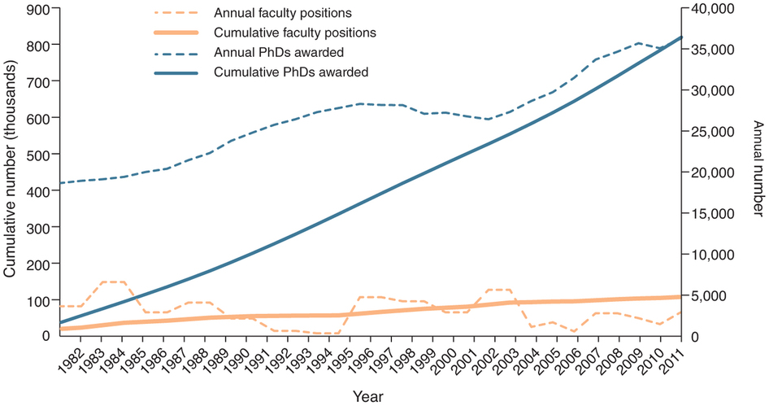

What is an R?  Why do I need it?  Why is it different from SPSS or Excel?  Is this a waste of my time?

The idea behind this session is to answer questions such as these, and to provide the practical grounding and basic terminology inherent doing computational science.

###Computational Science###
You might not identify yourself as a computational scientist, but you almost certainly do some basic computational science already.  If you're collecting quantitative data (i.e. information represented numerically or categorically), and using any kind of statistical methods implemented in a computer to find answers in this data, then that counts as computation.  Someone who identifies as a computational scientist simply scales this up such that it takes on a more primary role in their research.  In short, engaging in computational social science means that you're creating quantitative models of social phenomena with a computer in an effort to describe, understand, and predict these phenomena.  

Note that this sounds fancier than it actually is.  We create quantitative models of our data all the time.  An average, for example, is a basic quantitative model.  Likely the biggest distinguishing feature of someone who takes a computational approach in comparison to someone who does not is that the former is drastically more likely to use simulations to help with their research.  This is something that psychologists typically get little-to-no training in.

####Motivation for Computation####
There are lots of good reasons to have some familiarity with computation as an approach to scientific inquiry.  First, we're all doing an increasingly large portion of our scientific work *on* computers.  To that end, it makes sense that we should be able to maximize their utility.  You wouldn't want to be a chef who didn't really understand how a stove works, right?  As a scientist, one of your primary tools (aside from your brain) is your computer.  You should have a good understanding of how it works.

Second, as psychologists, one of our fundamental units of interest is behavior.  If you read old psychology journals, there are a ton of awesome studies where researchers go out to the world and observe the thing that they're interested in.  This is not true to the same extent today.  I'm not sure why, exactly.  The changing nature of the discipline is an interesting question, but I guess it doesn't matter so much for our purposes.  What *does* matter is that today we can do this important observational work on a vastly grander scale with much less effort.  Much of our overt behavior is recorded digitally, and this trend is not exactly showing signs of reversing direction.  This is an extraordinarily rich set of data that is presently underutilized by psychologists.  In order to make use of it, it is cruial to know how to flexibly interact with a computer.

This kind of approach also has potential to change our science itself on a more fundamental level.  If you view the digital world as a vast repository of behavior, then the behavior of a bunch of psychologists running their typical underpowered studies are no different from any other kind of behavior.  Instead of thinking about what an individual study says about our tendency to do X, it starts to become much easier to think about and investigate the entire *population of studies* which talk about X.  The information is available digitally, it's only a question of whether you have the tools to access it.  

Further, I've found that this mode of thinking leads to viewing digital information in a radically different way:  photos, speeches, articles, links, books, movies, geotags, tables on webpages, etc. are all totally viable sources of data with which I can address my research questions with rigorous quantitative methods.  The only hurdles to this are to what extent the information is accessible, and the amount of effort needed to give some kind of structure to these more unstructured data types.

A few final pragmatic notes:  First, the dominant methodological training received by psychologists consists of one to two classes on how to design an experiment or observational study, and one or more classes in statistics.  In other words, we focus quite a bit on the 'data collection' and 'model' in the following figure:


While those things are clearly extremely important, I would argue that cleaning data, transforming data, and visualizing data take up a far greater proportion of the researcher's time and energy.  These are the kind of tasks that computational methods can help out with in a big way.  Unfortunately, for some reason, they're typically overlooked as something which is deserving of training.

Second, computation isn't going away anytime soon.  It's up to you to leverage it in useful ways for your research.  If you decide not to, opting to do things by hand instead, you will lose to those who are not spending their days reorganizing excel files.

Speaking of which...



The above figure was published in *Nature* and refers to the science & engineering disciplines and shows that about 85% of PhDs will not work in a tenure track position.  This implies that of the 11 of us on this mailing list, 9 of us are going to go do something else.  I'm happy to talk to any of you about this in greater detail at any time - we don't receive nearly enough advice on this front, but for now, let's focus on the fact that of all the things you will learn to do in grad school, understanding computational methods and statistics is one of the more attractive, lucrative, and marketable skills you can have.

####It Ain't all good news####
Even though I'm a big fan of doing this type of research, I don't mean to sell it as the magic bullet to answering all kinds of social questions.  In particular, there are some serious shortcomings to this brand of research.  These are frequently overlooked by both those who consume this type of work and those who produce it.

1.  Sample =/= population
  This is true in traditional psychology too.  We don't often consider how our sample does or does not represent the population we're interested in.  While this can be a problem in experiments, it's a much bigger problem with observational type studies.  Mining information from the web can lead to some real problems if you don't seriously consider how your particular sample may be different from the whole population.
  
2.  Observation is not causation.
These unstructured types of information mean that you're going to have hard time inferring causality with any reasonable degree of certainty.  This is not always true.  You can, for example, run really creative randomized studies on the web, or using mobile devices, but when dealing with these basic ideas of working with already existing data - you can't do much in the way of claiming causal processes.  For that, you're either going to need to run a lab experiment or one of these web or mobile device based experiment (creative or otherwise...)

3.  Thoughts are difficult to see
  When you browse the web or look at some digital traces of behavior, there may be an indication of the underlying psychological processes, but your access to this information is going to be pretty poor.  This shouldn't be too discouraging - psychologists have been dealing with this problem since the dawn of the field.  Thoughts and psychological processes are not directly observable in *any* situation, including in a lab experiment.  We've typically managed to find creative ways around the issue, and accept this fundamental limitation for what it is.  This idea is true here too, but in a slightly different way than we're used to dealing with it.
  
4.  It's just a tool
  You should be more than just your tools.  Even if you're a top-notch programmer and data wrangler, it's all for naught if your questions suck, or you don't think about the implications of these data in a psychologically interesting way.  
  
####The big picture####
We are professionals in a field where our currency is data (or at least, it should be...).  Even if you don't want to wade into the whole mess of behavior that's available digitally and view your science as something which fundamentally must take place in a laboratory setting with real human interactions and minimal computer involvement, being comfortable with computational approaches to your data has the potential to drastically simplify the way you approach statistical analysis.  This might sound counterintuitive, but that's largely because computing and simulating are absolutely ignored as something that psychologists should receive training in, and as such, remain mysterious and scary.  By talking very plainly about some of these ideas, I think we can make transparent the opaque and dispel some of these fears.

So, how do we do all this?  Well, we need to talk to the computer in a *flexible* way.  In order to do that, we need to know how to program.

###Programming###
A programming language is something which lets us tell a computer what to do.  When programming, you must remember that you're talking to a machine.  And machines, while quick and precise, are very, very stupid.  I often use an example of telling a computer to do something we find extraordinarily simple, like pick up a glass of water.

**Me:** Computer, pick up the glass of water!  
**Hal:**  I'm afraid I can't do that, ~~Dave~~ Travis.  
**Me:** Ugh, why not?  
**Hal:**  Well, it's sitting on the table on the other side of the room.  
**Me:** Fine, walk over to the other side of the room, then pick up the glass of water.  
**Hal:**  Sorry, I'm afraid I can't do that.  
**Me:**  Why not?  
**Hal:**  Well, I'm sitting down.  I can't walk while sitting.  
**Me:**  Okay.  Stand up and walk over to the other side of the room, then pick up the glass of water.  
**Hal:**  Well, I've walked over to the other side of the room, but I'm sorry to report that I still can't pick up the water.

...and on and on and on.  Since machines are very stupid, it is *completely expected* that you will experience a ton of errors while working with them.  In fact, your experience of programming should be basically moving on from one error to the next.  As soon as you get something to work, you'll want to do something else, which will probably not work at all (or at least, not work in the way you want it to) the first time.  Don't let this be discouraging.  View it as a puzzle that you're continually trying to solve.

####Languages####
There are three programming languages which are popular with scientists - R, Python, and Matlab.  Each of these languages have distinct strengths and weaknesses.  

######Matlab#####
Matlab has a wide user base in academia, especially in engineering disciplines.  It was originally developed as a matrix and linear algebra tool, and, as such, this is one of its strengths, along with pretty good-looking visualizations.  It's also fabulously expensive.

######Python###### 
Python is a more general-purpose programming language.  While it can also do matrix and linear algebra, python does lots of other work too - from building games to running web applications to scientific computing.  It's a swiss-army knife, and was designed first and foremost to be intuitive and readable.  It's arguably easier for a newcomer to learn Python than most other languages, and it's often one of the first ones taught to CS students.  Python is free and is almost certainly already installed on any computer you use.  It's also slightly unwieldy for many statistical applications, though this is quickly changing as people develop add-ons (called modules) for the language.

#####R#####
R is a programming language developed explicitly for statistics.  While it can do essentially everything that matlab and python can (sometimes in really cumbersome ways), it really shines when you're working with data and building statistical models.  This strength, along with a large user base (i.e. lots of people willing to help you), fantastic visualizations, and the fact that it's free and open-source has made it very popular in academia and industry.

#####Software Applications#####
In contrast, to the above, most of you have probably tackled your data using a pre-packaged software application such as Excel, SAS, STATA, or SPSS.  These tools will perform statistical analyses for you, but are lacking in some crucial areas.  Excel, for example, chokes on larger datasets and can't actually run a lot of statistical analyses.  SPSS is extremely expensive, limits your analytic options (though not to the same extent as Excel), and is either not capable of or less efficient in doing the kind of data cleaning and transforming that scientists often need.  SAS has arguably a steeper learning curve than R, Python, or Matlab, but doesn't really offer the same advantages that these fully fledged programming languages do.

There are lots of differences between each of these tools, and sometimes there are good reasons to use each of them.  I can see an argument for using something like SPSS or STATA in an introductory statistics class for a bunch of psych majors who don't have very much experience with computers or quantitative methods.  I still use excel sometimes to look at a dataset if it loads into R in an unexpected way and I can't figure out what's going on with it.

I've encountered an analogy in a few places on the web.  Excel, SAS, Stata, and SPSS are a bit like city buses.  They're easy to use, generally get you to where you want to go, and are available to the masses.

R, Python, Matlab, and other programming languages, on the other hand, are more like an all-wheel-drive SUV with a mountain bike and kayak strapped to the roof, with a skateboard, running shoes, and hiking gear in the trunk, open airline tickets in the glove compartment, keys to a helicopter attached to the sun visor, and a gps attached to the dashboard.

Sure, the latter is bit more complicated to use, but the payoff is almost always going to be well-worth it.

####How to do it - broadly####  
#####To program is to problem solve#####  
When you're working on a program or analyzing a dataset it can be overwhelming to just open up R and stare at the blinking cursor and blank scripting screen.  To reduce this discouraging feeling, it helps to think of what you're doing as an exercise in problem solving.  In order to engage in effective problem solving, there are a series of steps one should take.

1.  Define the problem more formally
2.  Define the sub-problems.
3.  Think about ways to accomplish the smaller sub-problems
4.  Implement those solutions clearly and accurately.

#####Interactive vs Script based programming#####
There are two ways to use a programming language like R.  In interactive mode, you can simply type commands at the console.  


There's nothing stopping you from only using this to do all your programming and analyses.  However, it's much better suited for testing out small pieces of code before embedding those in a larger program.

Using scripts, you can store many individual commands and run them sequentially in order to accomplish some task.  If you do this, then you've written a computer program.  For example, this is a short program I wrote to calculate d-prime (a signal detection theoretic measure of sensitivity to the presence of some stimulus) for data I collected as part of my dissertation.  Why did I do this?  Because I got sick of retyping the same damn things over and over again.  Now that I have a program, I can just run these lines to get my d-prime measures.

```{r, eval=F}
dprime <- function(response, signal, units = NULL, conditions = NULL){
  
  #Checks for specification of units & conditions.  Assigns arbitrary values if not specified
  if(is.null(units)){
    tmp.units <- rep(1, length(response))
    unit.labels <- 1
  }
  else {
    tmp.units <- units
    unit.labels <- names(table(units))
  }
  if(is.null(conditions)){
    tmp.conditions <- rep(1, length(response))
    condition.labels <- 1
  }
  else {
    tmp.conditions <- conditions
    condition.labels <- names(table(conditions))
  }
  
  #Create table(s) of observations
  tmp<-table(response, signal, factor(tmp.units), tmp.conditions)
  #replace zeros to ensure no dividing by zero
  tmp[tmp==0] <- .01
  tp <- tmp[2,2,,]/(tmp[2,2,,]+tmp[1,2,,]) #hits
  fa <- tmp[2,1,,]/(tmp[2,1,,]+tmp[1,1,,]) #false alarms
  dprime <- qnorm(tp) - qnorm(fa) #dprime
  c <- -.5*((qnorm(tp) + qnorm(fa))) #c
  
  df<-data.frame('unit' = rep(unit.labels, length(condition.labels)),
                 'hit.rate' = c(tp), 
                 'false.alarm.rate' = c(fa), 
                 'dprime' = c(dprime), 
                 'criterion' = c(c), 
                 'condition' = rep(condition.labels, each=length(unit.labels))
  )
}
```

Don't worry if you don't understand what's going on there.  This is just meant to illustrate that one can chain together a bunch of commands and execute them in a sequence in order to achieve some desired outcome

There are some commonalities across all programs.  Specifically, every program will have:

**1.  Input**  This gives the program something to work with.  It can be an external file (e.g. an excel document), some input from a keyboard (e.g. pressing the 'fire' button in space invaders), or information from another program.  In my dprime program, I gave it a bunch of observations that indicate whether a stimulus was present, and a bunch of observations that indiate whether the participant said that a stimulus was present.

**2.  Output**  This is what you get from running the program.  Sometimes this means that something will just be displayed on the screen (e.g. your rocket ship fires a laser), and other times it means that there will be some new object on your computer.  For example, in my d-prime program, it gives as output a dataframe (kind of like an excel document) where I have all the d-prime metrics calculated for each individual.

All programs will do one of the following, and most do all of the following:

**3.  Math**  Add, subtract, divide, etc.  This should be straightforward.  In my dprime program, for instance, I needed to calculate the number of 'false alarms', or instances in which the participant said there was a stimulus when there wasn't.  To get this number, I had to divide the total number of times a participant said that there was a stimulus when there wasn't over the total number of times that there wasn't a stimulus.

**4.  Logic**  By logic, I mean formal logic.  That is, evaluation of whether something is true or false.  Your spaceship in space invaders, for example, should only fire a laser if the user presses the 'fire' button, and never at any other time.  In my dprime program, when I call it, I can give a couple of extra optional inputs (units or participants and conditions).  If the user doesn't provide this information, I need to assign information to these categories so that the program runs.  So, you can see a couple of if-else statements.  I'm checking to see if the user has given these inputs, and if not, assigning some arbitrary value to them.

**5.  Repetition**  Do something over and over and over and over again.  Sometimes with a bit of variation.  In my dprime program, it performs the d-prime calculation for any number of participants I might have run in my experiment.  It will similarly do this for any number of conditions for those participants.  So, if I had 4 conditions and 20 participants, I would receive, as ouptut, 80 dprime values.

The nice thing about this structure, is that it gives you a problem-solving framework.  When you've got your problem, the input and output are probably reasonably well-defined.  It's up to you to figure out the math, logic, and repetition needed in order to take the former and produce the latter.

####Errors####
Like I mentioned previously, these are a constant companion to doing this type of work.  There are lots of reasons why errors arise in code, but two general classes that you'll encounter early and often are syntax errors and semantic errors.

A **Syntax** error occurs when you type something that the language doesn't recognize as valid.  Programming languages are very strict about what kinds of things are recognized as valid.  For instance:

```{r, eval=F}
1 + (7/2
```

An error results because it's a stupid machine.  Clearly, all I've done is inadvertently left off a closing parentheses.  Computers, however, don't do these kind of liberal interpretations well at all.  In fact, they don't do them period.  These kinds of mistakes occur all the time, even in veteran programmers.  Fortunately, they're easy to solve - just track down the offending piece of code and fix the syntax.

**Semantic** errors are a bit more dangerous.  With a semantic error, your code will execute okay, but wont do what you had intended.  These can often happen when you're chaining together lengthy strings of math and logic in order to achieve some desired end.  Maybe you multiply instead of divide somewhere.  These are also often more difficult to track down.

###Closing thoughts###
I haven't spoken much about R explicitly here, but hopefully the *idea* of R is a little more comfortable now than it was when we started.  Maybe everything I've written here sounds a bit like prostelytizing.  I'm clearly a fan of this approach to science and think it offers huge advantages to those who use these ideas.  However, I want to be clear that I don't think that computational methods are necessary to do good science - you can do just fine with a pencil and paper and perhaps a [quipu][ref1], though I'm not sure why you would want to.  Similarly, just because you're using computational methods doesn't mean that you're not producing garbage science.

###References###
- Allen Downey's [*Think Python*][ref2] book  
- Matthew Salganik's [Advanced Data Analysis for the Social Sciences][ref3] class at Princeton  
- [Computing for Social Sciences][ref4], taught by James Evans, Peter McMahan, and Michael Castelle at The University of Chicago  
- Brendan O'Connor's insightful [blog post and subsequent discussion][ref5] of various data analysis tools  

[ref1]: <http://en.wikipedia.org/wiki/Quipu>
[ref2]: <http://www.greenteapress.com/thinkpython/html/index.html>
[ref3]: <http://www.princeton.edu/~mjs3/soc504_s2015/>
[ref4]: <http://cfss.uchicago.edu/
[ref5]: <http://brenocon.com/blog/2009/02/comparison-of-data-analysis-packages-r-matlab-scipy-excel-sas-spss-stata/>
