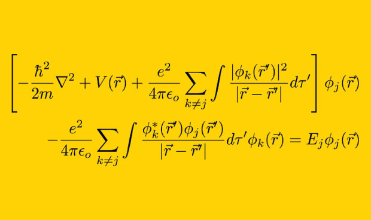
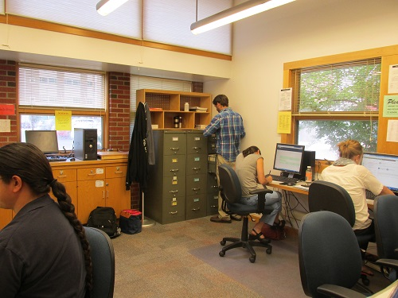
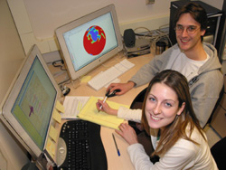
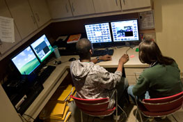
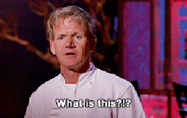
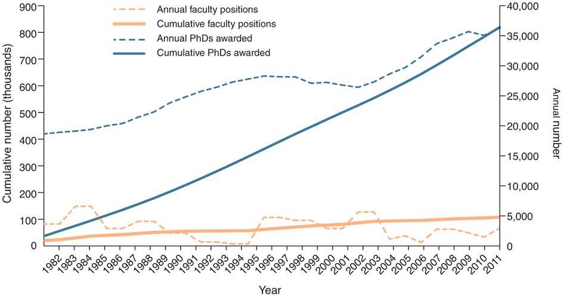

## Today's plan

- Start with square one:  

## Today's plan

- Start with square one:  
    - What is computational science?
    - What does it mean to program?

## Computational Science

sounds like this

## Computational Science

But actually more like this

## Computational Science

better...

## Computational Science

perfect!

## Computational Science

In your research, if you're using any kind of quantitative or statistical methods as implemented in a computer, then you're doing computational science.

## Computational Science

Scale this up, include some simulation, and you're a computational scientist.

## Why Computation?

## Why Computation?

## Why Computation?

## Why Computation?

As a scientist in the 21st century, the computer is one of the most important tools you will use, so you should know how to use it.

## Why Computation?

You want to observe [behavior](http://internet-map.net/)?

## Why Computation?

We run experiments on mechanical turk, but seem to be positively allergic to the vast repository of behavior that is the internet.

## Why Computation?

## Why Computation?

## Caveats

