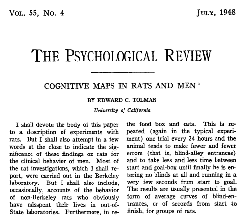

## Today's plan

- Start with square one:  


## Today's plan

- Start with square one:  
    - What is computational science?
    - What does it mean to program?

## Computational Science

sounds like this


## Computational Science

But actually more like this


## Computational Science

better...


## Computational Science

perfect!


## Computational Science

In your research, if you're using any kind of quantitative or statistical methods as implemented in a computer, then you're doing computational science.

## Computational Science

Scale this up, include some simulation, and you're a computational scientist.

## Why Computation?


## Why Computation?


## Why Computation?


## Why Computation?

As a scientist in the 21st century, the computer is one of the most important tools you will use, so you should know how to use it.

## Why Computation?

You want to observe [behavior](http://internet-map.net/)?

## Why Computation?

We run experiments on mechanical turk, but seem to be positively allergic to the vast repository of behavior that is the internet.

## Why Computation?


## Why Computation?  {.smaller}


## Caveats

- This does not solve all of our science problems.

## Caveats

- This does not solve all of our science problems.
    - Some get worse!
        
## Caveats {.smaller}


## Caveats


## Caveats



## Caveats

- Never lose sight of the fact that we're here for the questions, not the tools.

## Computational Science

- Our data is our currency
- The ability to flexibly work with our data (whatever its type) is paramount
- Computation gives us the ability to do this, but we need to be able to program.

## Programming

> - Programming languages are the interface between us and the machine - allows us very specifically tell a computer what to do
> - Never forget - computers are very fast and very precise
> - Never forget - they're also very stupid

## Programming Languages in Science

There are three primary languages used by scientists

- Matlab
- Python
- R

## Matlab

- Wide user base in academia, especially engineering
- Originally developed for matrix & linear algebra.
- Good-looking visualizations
- Really expensive

## Python

- General-purpose programming language (i.e. swiss-army knife)
- Large user base
- Intuitive
- Readable
- Free
- slightly unwieldy for statistical applications (but rapidly getting better!)

## R

- Developed explicitly for statistics
- Large user base
- Excellent visualizations
- Free

## Other software applications

- Excel, SAS, STATA, SPSS, etc.
- Each can be useful tools, but are often lacking in crucial areas
- Excel can't handle larger datasets & can't run many types of analyses
- SPSS is astonishingly expensive, doesn't have full support for many analytic options, and is less efficient at/can't do data cleaning & transformation scientists often need.
- etc.

## Other software applications

- This doesn't mean that these other applications aren't useful!
- E.G. use SPSS/STATA in an intro stats class?
- Excel as a quick organizational tool, double check datasets when they don't load correctly

## An analogy

Software applications


Works great!  But...

## An analogy

Programming languages


except environmentally friendly, and with your own plane

## How to Program

Step one:  don't let this intimidate you:


## How to Program

> - What you're really doing is problem solving
> - As a scientist, you should be well-versed in this

## How to Program

1.  Define the problem more formally
2.  Define the sub-problems
3.  Think about ways to accomplish the smaller sub-problems
4.  Implement those solutions clearly and accurately
5.  See step 1

## Interactive Programming


## Script Based Programming


## Programming Commonalities

**Input**  
Something that the program can work with.  Data, an external file, input from the keyboard, etc.


## Programming Commonalities

**Output**
What you get from running the program


## Programming commonalities

**Math**
Y'know - addition, subtraction, etc.


## Programming commonalities

**Logic**
Formal, symbolic, mathematical logic.  Evaluate statements as true or false


## Programming commonalities

**Repetition**
The things that you hate making RA's do because you know that they're really boring


## Errors

> - Errors are a constant companion when engaged in programming
> - You will experience a metric **SHIT TON** of them
> - It isn't because you're bad at programming or incapable of computation - this is just what it is to program.

## Errors

> - As you progress, the errors don't become less frequent, but they *do* become more unusual
> - As soon as you get something to to work, you'll move on to the next thing - which wont.
> - Don't get discouraged - this is a puzzle that you're continually trying to solve.
>   - Kind of like science more generally, no?

## Syntax errors

- Due to invalid language.

```{r, eval=F}
1 + (7/2
```

- Languages are very strict about the kinds of things that are valid.

## Semantic errors

- Code executes, but does something other than what you intend.

## Closing thoughts

- *Yes*, I am preaching a bit - computational approaches offer huge advantages 

> **However**

> - Computational approaches are not necessary


## Closing thoughts

- Computational approaches are not sufficient

