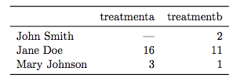
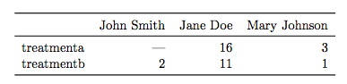
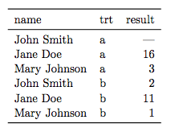

RA Seminar
========================================================
date: 11/15/16
autosize: true

Review
========================================================

Last week, Kaytee taught us how to use R as a computer


```r
1+1
```

```
[1] 2
```

Review
========================================================

We learned that all data are stored into objects. These objects can be one of several types. 

They can be numeric

```r
x <- 5
x
```

```
[1] 5
```

```r
str(x)
```

```
 num 5
```

or characters

```r
x <- 'Kaytee'
x
```

```
[1] "Kaytee"
```

```r
str(x)
```

```
 chr "Kaytee"
```

Review
========================================================

Careful! It's easy to be tricked!  

```r
x <- '5'
y <- 4
```


```r
x+y
```

`Error in x + y : non-numeric argument to binary operator`

Review
========================================================

Some objects are collections of other objects:


```r
name <- c('Tu Youyou', 'May-Britt Moser', 'Elinor Ostrom', 'Ada Yonath', 'Carol Greider', 'Elizabeth Blackburn')
year <- c(2015, 2014, 2009, 2009, 2009, 2009)
str(name)
```

```
 chr [1:6] "Tu Youyou" "May-Britt Moser" "Elinor Ostrom" ...
```

```r
str(year)
```

```
 num [1:6] 2015 2014 2009 2009 2009 ...
```

Review
========================================================

Dataframes are the 'apex' object type for most practical purposes. They eat all other objects and store them internally (as long as all the child objects are the same size!)


```r
df.badasses <- data.frame(name=name, year=year)
str(df.badasses)
```

```
'data.frame':	6 obs. of  2 variables:
 $ name: Factor w/ 6 levels "Ada Yonath","Carol Greider",..: 6 5 3 1 2 4
 $ year: num  2015 2014 2009 2009 2009 ...
```

Review
========================================================

We also went over functions - they take input in the form of arguments, do something to that input, and provide output

here's a function I just wrote:

```r
purple.dinosaur <- function(x){
  output <- paste(x, 'is a purple dinosaur', sep=' ')
  return(output)
}
```

What does this function do?

Who is a purple dinosaur?
========================================================


```r
purple.dinosaur('ronnie')
```

```
[1] "ronnie is a purple dinosaur"
```

Real data for Real people
========================================================
This is all well and good, but data in the wild isn't so nicely behaved as all this.

- Files don't make sense.
- Variable names are incomprehensible.
- It's structured in a way that doesn't lend itself to analysis or visualization
- It's stored in exotic file formats

80% of what you will do as a data analyst is fixing all of this.

Principles of Tidy Data
========================================================
If I give `n` individuals a bunch of questionnaires and ask you to enter them in a spreadsheet, I will receive back at least `n/2` different spreadsheets.

That's a problem.

*Tidy data* is a standard way of organizing data that allows the analyst to quickly visualize, model, and manipulate the underlying information.

Principles of Tidy Data
========================================================
Data most often live in rectangular tables that consist of rows and columns. 

**values** - numbers/strings. the raw details. This should be in the cells  
**variables** - a concept that measures some underlying attribute. A variable should contain all values for that attribute. This should be the column  
**observations** - all values measured on the same unit across attributes (in psychology, the unit is most typically a person). This should be the row.  

Principles of Tidy Data
========================================================




Principles of Tidy Data
========================================================

tidied:



Group task
========================================================

I'm giving you two datasets. These are *real data* from the connecticut middle school studies. So don't pass these data around! They are the climate assessments students completed periodically during their time in the study.

I'd like you to get into pairs and:

1. Load these data into R
2. Try to deduce what information it contains (i.e. what are the rows? what are the columns?)
3. The column names seem to have some naming convention. Can you figure out what it is?
4. I'm interested in students' sense of belonging. What information should I attend to?
5. There are two files. If we wanted to analyze both of these files together (e.g. do African American students feel a reduced sense of belonging?), why is the current setup not amenable to that task?

Group task 2
========================================================

**Description of the data**
Every piece of information for a given individual is arranged on their own row. Each question in a given survey gets its own column, and repeated administration of the same survey is denoted with the use of a suffix in the variable name, eg `belon1t2`, `belon1t10`, `belon1t19`, etc. This is a problem because:  

- question 1, question 2, question 3, etc. are the values of a variable we could call 'question'
- t2, t10, t19, are the values of a variable we could call 'time'.

So we have some variable values embedded in the question names.

get back into groups and tell me the steps in a process that are needed to convert the data we've been given into a tidy dataset. No need to program them - just write them down in a way that makes computational sense.
