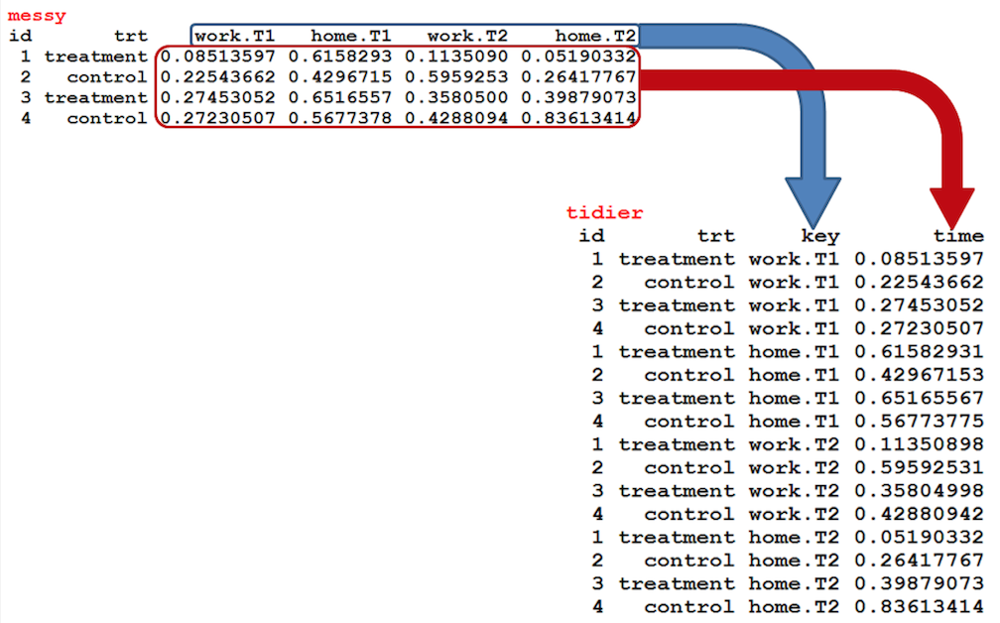
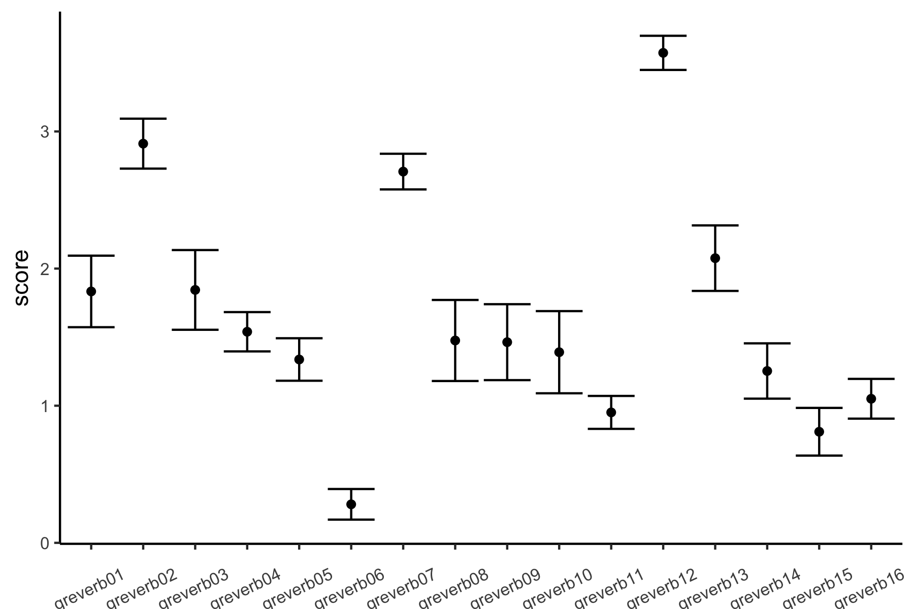

Dplyr workshop
========================================================
author: Travis Riddle
date: October 4th, 2017
autosize: true

Overview
========================================================

## What is this?
  - A short tutorial to help you work more efficiently with R

Overview
========================================================

## What is this?
  - A short tutorial to help you work more efficiently with R
  
## What is this *not*?
  - A statistics workshop

Goals
========================================================

1. Understand and use best practices for data "management" and how to get your data into this format
  - *tidy data* - `tidyr`

Goals
========================================================

1. Understand and use best practices for data "management" and how to get your data into this format
  - *tidy data* - `tidyr`
2. Learn the basic operations that allow you to quickly work with tidy data to get the information you need
  - *data pliers* - `dplyr`


Goals
========================================================

1. Understand and use best practices for data "management"
  - *tidy data* - `tidyr`
2. Learn the basic operations that allow you to quickly work with tidy data to get the information you need
  - *data pliers* - `dplyr`
3. Profit


Goals
========================================================

1. Understand and use best practices for data "management"
  - *tidy data* - `tidyr`
2. Learn the basic operations that allow you to quickly work with tidy data to get the information you need
  - *data pliers* - `dplyr`
3. Profit


slides: https://github.com/riddlet/StatsWorkshop/blob/master/Session%206/session_6.md

cheat sheet: https://www.rstudio.com/wp-content/uploads/2015/02/data-wrangling-cheatsheet.pdf

Data "management"
========================================================

All of our datasets should look the same:

  - rows = observations  
  - columns = variables
  - values = entries


```r
df <- read.csv('../Data/demog.csv')
head(df)
```

```
    ID       Study   Cohort        Ethnicity Gender
1 1001 Connecticut Cohort 1  Hispanic/Latino      f
2 1002 Connecticut Cohort 1 African American      m
3 1003 Connecticut Cohort 1 African American      f
4 1004 Connecticut Cohort 1 African American      f
5 1005 Connecticut Cohort 1            White      m
6 1006 Connecticut Cohort 1            White      m
```

Data "management"
========================================================

All of our datasets should look the same:

  - rows = observations  
  - columns = variables
  - values = entries
  - tables = distinct measurement units


```r
df <- read.csv('../Data/demog.csv')
head(df)
```

```
    ID       Study   Cohort        Ethnicity Gender
1 1001 Connecticut Cohort 1  Hispanic/Latino      f
2 1002 Connecticut Cohort 1 African American      m
3 1003 Connecticut Cohort 1 African American      f
4 1004 Connecticut Cohort 1 African American      f
5 1005 Connecticut Cohort 1            White      m
6 1006 Connecticut Cohort 1            White      m
```

Data "management"
========================================================

All of our datasets should look the same:

  - rows = observations  
  - columns = variables
  - values = entries
  - tables = distinct measurement units


```r
df <- read.csv('../Data/grades.csv')
head(df)
```

```
    ID       Study Grade Grade_type est_Grade_date intervention_year
1 1001 Connecticut   3.5   MATH GPA         2/1/04                 1
2 1002 Connecticut  3.33   MATH GPA         2/1/04                 1
3 1003 Connecticut   2.5   MATH GPA         2/1/04                 1
4 1004 Connecticut  2.67   MATH GPA         2/1/04                 1
5 1005 Connecticut 2.835   MATH GPA         2/1/04                 1
6 1006 Connecticut  3.33   MATH GPA         2/1/04                 1
```

Data "management"
========================================================

Advantages of tidy data:

  - The format works well with most modeling and plotting functions in R  
  
Data "management"
========================================================

Advantages of tidy data:

  - The format works well with most modeling and plotting functions in R  
  - A consistent format makes analyses across projects more consistent than they might be otherwise
  
Data "management"
========================================================

Advantages of tidy data:

  - The format works well with most modeling and plotting functions in R  
  - A consistent format makes analyses across projects more consistent than they might be otherwise
  - Reduces the number of steps needed to extract relevant information (?)
  
Data "management"
========================================================

Advantages of tidy data:

  - The format works well with most modeling and plotting functions in R  
  - A consistent format makes analyses across projects more consistent than they might be otherwise
  - Reduces the number of steps needed to extract relevant information (?)
  - Simplifies the procedure needed to extract relevant information

Data tidying
========================================================

Example dataset located at `https://goo.gl/zYGDMD`

- my data from grad school
- Mturk study
- (Attempted to) manipulated power with a writing assignment (e.g. Galinsky & Moskowitz, 2003; Galinsky et al, 2006).
- Measured all kinds of crap across 5 studies.

Data tidying
========================================================


```r
df <- read.csv('../Data/workshop_data.csv')
dim(df)
```

```
[1] 98 93
```

Data tidying
========================================================

 - All functions we'll look at have a similar *argument* structure:
 
 `foo(data_frame, other_stuff)`
 

Data tidying
========================================================

 - All functions we'll look at have a similar *argument* structure:
 
 `foo(data_frame, other_stuff)`
 
 - All functions we'll look at today return dataframes
 
 `new_data_frame <- foo(data_frame, other_stuff)`
 
 
 Data tidying
========================================================

 - All functions we'll look at have a similar *argument* structure:
 
 `foo(data_frame, other_stuff)`
 
 - All functions we'll look at today return dataframes
 
 `new_data_frame <- foo(data_frame, other_stuff)`
 
 - This consistent input -> argument -> output format will allow us to easily chain together operations to do what we want to our data, without worrying about whether the data is formatted appropriately

Tidy data functions (tidyr)
========================================================

- `gather`
- `spread`
- `separate`
- `unite`

Gather - wide to long
========================================================


```r
sub_df <- df[,c(1,7,55:82)]
names(sub_df)
```

```
 [1] "id"                    "power_cond"           
 [3] "diri_daydream"         "diri_tender"          
 [5] "diri_POV"              "diri_sorry"           
 [7] "diri_characters"       "diri_emergency"       
 [9] "diri_objective"        "diri_sides"           
[11] "diri_protective"       "diri_understand"      
[13] "diri_involved"         "diri_calm"            
[15] "diri_helpless"         "diri_misfortunes"     
[17] "diri_listen"           "diri_play"            
[19] "diri_tense"            "diri_pity"            
[21] "diri_effective"        "diri_touched"         
[23] "diri_twosides"         "diri_softhearted"     
[25] "diri_leadingcharacter" "diri_losecontrol"     
[27] "diri_shoes"            "diri_reading"         
[29] "diri_needshelp"        "diri_criticize"       
```

Gather - wide to long
========================================================


```r
head(sub_df, 2)
```

```
  id power_cond diri_daydream diri_tender diri_POV diri_sorry
1  1          2             2           3        1          1
2  3          0             3           4        3          3
  diri_characters diri_emergency diri_objective diri_sides diri_protective
1               3              3              1          2               3
2               4              4              3          4               3
  diri_understand diri_involved diri_calm diri_helpless diri_misfortunes
1               3             1         1             2                3
2               3             4         3             2                3
  diri_listen diri_play diri_tense diri_pity diri_effective diri_touched
1           1         2          3         2              1            3
2           3         3          4         3              2            4
  diri_twosides diri_softhearted diri_leadingcharacter diri_losecontrol
1             1                3                     4                1
2             4                4                     4                3
  diri_shoes diri_reading diri_needshelp diri_criticize
1          3            3              2              4
2          4            3              2              3
```

Gather - wide to long
========================================================

`gather(data_frame, key=new_column_name1, value=new_column_name2, ...=variables_you_want_to_gather)`


```r
library(tidyr)
dim(sub_df)
```

```
[1] 98 30
```

```r
sub_df <- gather(sub_df, variable, value, diri_daydream:diri_criticize)
dim(sub_df)
```

```
[1] 2744    4
```

Gather - wide to long
========================================================


```r
head(sub_df)
```

```
  id power_cond      variable value
1  1          2 diri_daydream     2
2  3          0 diri_daydream     3
3  5          0 diri_daydream     2
4  6          1 diri_daydream     3
5  7          0 diri_daydream     3
6  9          2 diri_daydream     2
```

Gather - wide to long
========================================================

## What did we do?

<div align='center'>

</div>

Gather - wide to long
========================================================

## Why did we do it?

<div align='center'>

</div>

Gather - wide to long
========================================================

Can select columns in a number of ways:

`gather(sub_df, variable, value, diri_daydream, diri_tender, diri_POV)`

Gather - wide to long
========================================================

Can select columns in a number of ways:

`gather(sub_df, variable, value, diri_daydream, diri_tender, diri_POV)`

`gather(sub_df, variable, value, -id, -power_cond)`

Gather - wide to long
========================================================

Can select columns in a number of ways:

`gather(sub_df, variable, value, diri_daydream, diri_tender, diri_POV)`

`gather(sub_df, variable, value, -id, -power_cond)`

`gather(sub_df, variable, value, starts_with('diri'))`

Gather - wide to long
========================================================

Can select columns in a number of ways:

`gather(sub_df, variable, value, diri_daydream, diri_tender, diri_POV)`

`gather(sub_df, variable, value, -id, -power_cond)`

`gather(sub_df, variable, value, starts_with('diri'))`

`gather(sub_df, variable, value, ends_with('sides'))`

Gather - wide to long
========================================================

Can select columns in a number of ways:

`gather(sub_df, variable, value, diri_daydream, diri_tender, diri_POV)`

`gather(sub_df, variable, value, -id, -power_cond)`

`gather(sub_df, variable, value, starts_with('diri'))`

`gather(sub_df, variable, value, ends_with('sides'))`

`gather(sub_df, variable, value, contains('help'))`

Spread - long to wide
========================================================
`spread(data_frame, key=column_that_contains_new_column_labels, value=column_that_contains_values)`


```r
dim(sub_df)
```

```
[1] 2744    4
```

```r
sub_df <- spread(sub_df, variable, value)
dim(sub_df)
```

```
[1] 98 30
```

Spread - long to wide
========================================================
## What did we do?

<div align='center'>

</div>

separate - one column into two
========================================================
`separate(data_frame, col=variable_to_separate, into=c('new', 'variables'), sep=thing_to_separate_on)`


```r
sub_df <- df[,c(1,7,31:42)]
dim(sub_df)
```

```
[1] 98 14
```

```r
sub_df <- gather(sub_df, variable, value, selfaq01:otheraq12)
head(sub_df)
```

```
  id power_cond variable value
1  1          2 selfaq01    70
2  3          0 selfaq01    63
3  5          0 selfaq01    50
4  6          1 selfaq01    77
5  7          0 selfaq01    66
6  9          2 selfaq01   100
```

separate - one column into two
========================================================
`separate(data_frame, col=variable_to_separate, into=c('new', 'variables'), sep=thing_to_separate_on)`


```r
sub_df <- df[,c(1,7,31:42)]
dim(sub_df)
```

```
[1] 98 14
```

```r
sub_df <- gather(sub_df, variable, value, selfaq01:otheraq12)
sub_df <- separate(sub_df, variable, into=c('target', 'question'), 'a')
head(sub_df)
```

```
  id power_cond target question value
1  1          2   self      q01    70
2  3          0   self      q01    63
3  5          0   self      q01    50
4  6          1   self      q01    77
5  7          0   self      q01    66
6  9          2   self      q01   100
```

separate - one column into two
========================================================
Can separate columns in a number of ways:

`separate(sub_df, variable, c('new', 'variables'), sep=3)`

`separate(sub_df, variable, c('new', 'variables'), sep=-2)`

`separate(sub_df, variable, c('new', 'variables'), sep='[f|r]')`


side note on the power & pain of regular expressions
========================================================
> Politics would be very important for people who are intrested @interested@ in being a lawer. @lawyer.@

side note on the power & pain of regular expressions
========================================================
> Politics would be very important for people who are intrested @interested@ in being a lawer. @lawyer.@

`essaytext <- gsub("\\w*'?\\w*['.,]?\\s?@(.*?)@", '\\1', essaytext)`


side note on the power & pain of regular expressions
========================================================
> Politics would be very important for people who are intrested @interested@ in being a lawer. @lawyer.@

`essaytext <- gsub("\\w*'?\\w*['.,]?\\s?@(.*?)@", '\\1', essaytext)`


side note on the power & pain of regular expressions
========================================================
> Politics would be very important for people who are intrested @interested@ in being a lawer. @lawyer.@

`essaytext <- gsub("\\w*'?\\w*['.,]?\\s?@(.*?)@", '\\1', essaytext)`


Build them up slowly. Make sure you've got a good tool to test it out. I like regex101:

https://regex101.com/

separate - one column into two
========================================================
Can separate columns in a number of ways:

`separate(sub_df, variable, c('new', 'variables'), sep=3)`

`separate(sub_df, variable, c('new', 'variables'), sep=-2)`

`separate(sub_df, variable, c('new', 'variables'), sep='[f|r]')`

unite - two columns into one
========================================================
`unite(data_frame, col=new_column_name, ...=columns_to_unite, sep='thing_to_separate_them')`


```r
head(sub_df)
```

```
  id power_cond target question value
1  1          2   self      q01    70
2  3          0   self      q01    63
3  5          0   self      q01    50
4  6          1   self      q01    77
5  7          0   self      q01    66
6  9          2   self      q01   100
```

unite - two columns into one
========================================================
`unite(data_frame, col=new_column_name, ...=columns_to_unite, sep='thing_to_separate_them')`


```r
sub_df <- unite(sub_df, all_questions, target, question, sep='_')
head(sub_df)
```

```
  id power_cond all_questions value
1  1          2      self_q01    70
2  3          0      self_q01    63
3  5          0      self_q01    50
4  6          1      self_q01    77
5  7          0      self_q01    66
6  9          2      self_q01   100
```

unite - two columns into one
========================================================
As before, you can select columns in a number of ways

`unite(sub_df, all_questions, target, question, value, sep='_')`

`unite(sub_df, all_questions, -id, -power_cond, sep='_')`

`unite(sub_df, all_questions, starts_with(....), sep='_')`

`unite(sub_df, all_questions, ends_with(...), sep='_')`

`unite(sub_df, all_questions, contains(...), sep='_')`

tidyr - your turn
========================================================

I want this data reformatted. I'm interested in examining how long people took. 

1. Describe what a tidy version of this would look like.

tidyr - your turn
========================================================

I want this data reformatted. I'm interested in examining how long people took. 

1. Describe what a tidy version of this would look like.
2. Using the verbs gather, spread, separate, and unite, describe the *steps* you should take to achieve that tidy data frame

tidyr - your turn
========================================================

I want this data reformatted. I'm interested in examining how long people took. 

1. Describe what a tidy version of this would look like.
2. Using the verbs gather, spread, separate, and unite, describe the *steps* you should take to achieve that tidy data frame
3. Make it happen!

Intermission
========================================================

Using these four tools, we can accomplish *most* tidying work.

Next items:

  - `%>%`
  - `dplyr`
  
The pipe
========================================================

The pipe `%>%` takes the output from one function and feeds it into the first argument of the next function


```r
x <- rnorm(mean=7, sd=1, 1000)
x %>% mean()
```

```
[1] 6.966288
```

The pipe
========================================================

The pipe `%>%` takes the output from one function and feeds it into the first argument of the next function


```r
rnorm(mean=7, sd=1, 1000) %>% mean(.)
```

```
[1] 6.992623
```

Piping in tidyverse
========================================================

Because everything in the tidyverse returns a full data frame, and all functions take a dataframe as the first argument, piping allows us to easily chain together sequences of operations


```r
library(dplyr) #to use select
df %>%
  select(id, contains('time')) %>%
  gather(time, value, -id) %>%
  separate(time, into=c('prefix', 'item'), 4) %>%
  separate(value, into=c('date', 'time'), ' ') %>%
  head()
```

```
  id prefix    item    date  time
1  1   time writing 11/7/13 18:35
2  3   time writing 11/7/13 18:35
3  5   time writing 11/7/13 18:38
4  6   time writing 11/7/13 18:36
5  7   time writing 11/7/13 18:36
6  9   time writing 11/7/13 18:37
```

The dplyr verbs, pt1
========================================================

`select` - pick out columns by name  

`filter` - pick out rows to keep  

`arrange` - reorder rows  

`mutate` - add new variable  

`summarise` - reduce many values to one (e.g. mean(x); sd(x))  

`group_by` - perform subsequent operations on groups within the dataframe  

Select - pick out columns by name
========================================================

`df %>% select(id, power_cond, greverb01)`

`df %>% select(-id, -number, -timewriting)`

`df %>% select(-diri_daydream:-diri_needshelp)`

`df %>% select(starts_with('selfsuff'))`

`df %>% select(one_of('id', 'power_cond'))`

`df %>% select(num_range('timesurvey', 2:4))`

`df %>% select(matches('awful_regular_expression'))`

`df %>% select(ends_with('writing'))`

`df %>% select(contains('diri'))`

Select - pick out columns by name
========================================================

understanding what is possible is more valuable than memorizing all these

Filter - pick out rows to keep
========================================================


```r
df %>% 
  select(id, power_cond) %>%
  filter(power_cond==0) %>%
  head()
```

```
  id power_cond
1  3          0
2  5          0
3  7          0
4 10          0
5 11          0
6 21          0
```

Filter - pick out rows to keep
========================================================

You should understand boolean operators:

`>`, `>=` - greater than/greater than or equal to  
`<`, `<=` - less than/less than or equal to  
`==` - is equal to  
`!=` - is not equal to  
`&` - and (used to select cases that meet multiple criteria)  
`|` - or (used to select cases that meet one of multiple criteria)  

Filter - pick out rows to keep
========================================================


```r
df %>%
  select(id, ethnicity) %>%
  filter(ethnicity=='American Indian or Alaskan Native' |
           ethnicity=='Black or African American') 
```

```
  id                         ethnicity
1 14 American Indian or Alaskan Native
2 22 American Indian or Alaskan Native
3 33 American Indian or Alaskan Native
4 95         Black or African American
```

Filter - pick out rows to keep
========================================================


```r
df %>%
  select(id, ethnicity) %>%
  filter(ethnicity=='American Indian or Alaskan Native' &
           ethnicity=='Black or African American') 
```

```
[1] id        ethnicity
<0 rows> (or 0-length row.names)
```

Filter - pick out rows to keep
========================================================


```r
df %>%
  select(id, power_cond, ethnicity) %>%
  filter(ethnicity=='Asian' &
           power_cond==1) 
```

```
   id power_cond ethnicity
1  35          1     Asian
2  44          1     Asian
3  85          1     Asian
4 125          1     Asian
5 126          1     Asian
```

arrange - reorder rows
========================================================


```r
df %>%
  select(id, age) %>%
  arrange(age) %>%
  head()
```

```
  id age
1 85  18
2 96  20
3 97  20
4  3  21
5 62  21
6 79  21
```

arrange - reorder rows
========================================================


```r
df %>%
  select(id, age) %>%
  filter(age!='NULL') %>%
  arrange(desc(age)) %>%
  head()
```

```
   id age
1  49  80
2 118  61
3  40  58
4 121  57
5  99  56
6  47  54
```

mutate - make new variable
========================================================

ugh. factors.


```r
df %>%
  mutate(selfsuff_sum = selfsuff01+selfsuff02+selfsuff03+selfsuff04) %>%
  select(id, selfsuff01:selfsuff04, selfsuff_sum) 
```

```
    id selfsuff01 selfsuff02 selfsuff03 selfsuff04 selfsuff_sum
1    1          7          8          5          3           NA
2    3          7          7          7          4           NA
3    5          9          6          6          7           NA
4    6          8          4          6          6           NA
5    7          7          7          7          3           NA
6    9          8          6          6          3           NA
7   10       NULL       NULL       NULL       NULL           NA
8   11          5          5          5          5           NA
9   12          7          2          3          3           NA
10  13          9          8          7          5           NA
11  14          7          5          7          2           NA
12  15          7          4          5          4           NA
13  16          9          2          8          3           NA
14  17       NULL       NULL       NULL       NULL           NA
15  18          8          6          5          4           NA
16  21          7          6          7          5           NA
17  22          8          8          8          1           NA
18  24          8          8          9          2           NA
19  25          9          3          7          3           NA
20  26       NULL       NULL       NULL       NULL           NA
21  27          3          7          4          6           NA
22  28          7          4          5          4           NA
23  29          7          8          8          2           NA
24  32          6          4          4          3           NA
25  33          7          7          7          6           NA
26  34       NULL       NULL       NULL       NULL           NA
27  35          8          6          6          3           NA
28  36          8          4          1          9           NA
29  37          8          7          9          7           NA
30  40          7          7          7          7           NA
31  42       NULL       NULL       NULL       NULL           NA
32  43          7          6          3          4           NA
33  44          9          8          9          9           NA
34  45          9          7          9          4           NA
35  46       NULL       NULL       NULL       NULL           NA
36  47          8          7          8          7           NA
37  48          7          7          7          3           NA
38  49          7          3          6          3           NA
39  51          6          6          6          6           NA
40  53          7          8          7          7           NA
41  54          7          3          6          7           NA
42  56          8          8          7          6           NA
43  58          4          3          3          2           NA
44  59          9          9          9          8           NA
45  60          7          5          7          4           NA
46  61       NULL       NULL       NULL       NULL           NA
47  62          6          4          6          5           NA
48  63       NULL       NULL       NULL       NULL           NA
49  64          9          7          6          9           NA
50  65          7          3          1          3           NA
51  67          5          5          5          5           NA
52  68          7          3          7          6           NA
53  69          7          5          6          5           NA
54  70          6          3          4          7           NA
55  71          6          4          6          4           NA
56  72          8          6          7          9           NA
57  73          9          9          9          9           NA
58  74          7          3          5          4           NA
59  75       NULL       NULL       NULL       NULL           NA
60  76          8          4          7          9           NA
61  77       NULL       NULL       NULL       NULL           NA
62  78          6          4          5          4           NA
63  79          7          7          7          5           NA
64  80          5          3          4          3           NA
65  83          9          6          7          4           NA
66  84          9          7          9          6           NA
67  85          8          8          6          7           NA
68  86          4          3          3          1           NA
69  87          4          6          7          7           NA
70  88       NULL       NULL       NULL       NULL           NA
71  89          8          7          7          4           NA
72  90          9          4          6          4           NA
73  91       NULL       NULL       NULL       NULL           NA
74  92       NULL       NULL       NULL       NULL           NA
75  93          4          4          2          8           NA
76  94       NULL       NULL       NULL       NULL           NA
77  95          8          8          7          4           NA
78  96          7          7          6          3           NA
79  97          7          6          7          5           NA
80  98       NULL       NULL       NULL       NULL           NA
81  99          7          7          3          1           NA
82 100       NULL       NULL       NULL       NULL           NA
83 101          7          7          7          4           NA
84 104          6          4          6          3           NA
85 105       NULL       NULL       NULL       NULL           NA
86 108          8          5          9          9           NA
87 111          7          9          7          3           NA
88 113          8          7          7          1           NA
89 114       NULL       NULL       NULL       NULL           NA
90 115       NULL       NULL       NULL       NULL           NA
91 117       NULL       NULL       NULL       NULL           NA
92 118          8          8          7          8           NA
93 120          8          4          7          1           NA
94 121          6          5          4          3           NA
95 123          8          8          8          8           NA
96 125          7          6          7          5           NA
97 126          9          8          7          5           NA
98 128          9          1          3          2           NA
```

mutate - make new variable
========================================================

`mutate_at` to the rescue!


```r
df %>%
  mutate_at(vars(selfsuff01:selfsuff04), funs(as.numeric(as.character(.)))) %>%
  mutate(selfsuff_sum = selfsuff01+selfsuff02+selfsuff03+selfsuff04) %>%
  select(id, selfsuff01:selfsuff04, selfsuff_sum)  %>%
  head()
```

```
  id selfsuff01 selfsuff02 selfsuff03 selfsuff04 selfsuff_sum
1  1          7          8          5          3           23
2  3          7          7          7          4           25
3  5          9          6          6          7           28
4  6          8          4          6          6           24
5  7          7          7          7          3           24
6  9          8          6          6          3           23
```

summarise - reduce many values to one
========================================================


```r
df %>%
  summarise(word_count = mean(qdap::wc(writing)))
```

```
  word_count
1   82.92857
```

summarise - reduce many values to one
========================================================


```r
df %>%
  summarise(word_count = mean(qdap::wc(writing)))
```

```
  word_count
1   82.92857
```

group_by - perform subsequent operations on specified groups
========================================================


```r
df %>%
  group_by(power_cond) %>%
  summarise(word_count = mean(qdap::wc(writing)),
            sd_wc = sd(qdap::wc(writing)))
```

```
# A tibble: 3 x 3
  power_cond word_count    sd_wc
       <int>      <dbl>    <dbl>
1          0   79.50000 49.67962
2          1   85.20000 46.19163
3          2   84.21951 44.82550
```

group_by - perform subsequent operations on specified groups
========================================================


```r
df %>%
  group_by(power_cond) %>%
  summarise(word_count = mean(qdap::wc(writing)),
            sd_wc = sd(qdap::wc(writing)),
            se_wc = sd(qdap::wc(writing))/sqrt(n()))
```

```
# A tibble: 3 x 4
  power_cond word_count    sd_wc    se_wc
       <int>      <dbl>    <dbl>    <dbl>
1          0   79.50000 49.67962 8.782199
2          1   85.20000 46.19163 9.238326
3          2   84.21951 44.82550 7.000567
```

Recall
========================================================

- `gather` ?

Recall
========================================================

- `gather` - wide to long
- `filter` - ?

Recall
========================================================

- `gather` - wide to long
- `filter` - select rows to keep
- `unite` - ?

Recall
========================================================

- `gather` - wide to long
- `filter` - select rows to keep
- `unite` - combine multiple columns into one\
- `group_by` - ?

Recall
========================================================

- `gather` - wide to long
- `filter` - select rows to keep
- `unite` - combine multiple columns into one
- `group_by` - perform subsequent operations on groups with common values of identified column(s)

Self-test?
========================================================

What does this do?


```r
df %>%
  select(id, contains('greverb')) %>%
  gather(question, value, -id) %>%
  mutate(value = as.numeric(as.character(value))) %>%
  group_by(id) %>%
  summarise(outcome = mean(value, na.rm=T))
```


Your turn
========================================================

Are any of the gre verbal questions especially hard or easy?

Make a pipeline that shows the gre questions, sorted from the easiest (highest value) to the hardest (lowest value)

Your turn
========================================================


```r
df %>%
  select(id, contains('greverb')) %>%
  gather(question, value, -id) %>%
  mutate(value = as.numeric(as.character(value))) %>%
  group_by(question) %>%
  summarise(outcome = mean(value, na.rm=T)) %>%
  arrange(outcome)
```

```
# A tibble: 16 x 2
    question   outcome
       <chr>     <dbl>
 1 greverb06 0.2808989
 2 greverb15 0.8101266
 3 greverb11 0.9512195
 4 greverb16 1.0506329
 5 greverb14 1.2531646
 6 greverb05 1.3370787
 7 greverb10 1.3902439
 8 greverb09 1.4634146
 9 greverb08 1.4756098
10 greverb04 1.5393258
11 greverb01 1.8333333
12 greverb03 1.8444444
13 greverb13 2.0759494
14 greverb07 2.7073171
15 greverb02 2.9111111
16 greverb12 3.5731707
```

Bonus!
========================================================

Understand joining operations:


Bonus!
========================================================

Understand joining operations:

```r
dim(df)
```

```
[1] 98 93
```

```r
df %>%
  group_by(power_cond) %>%
  summarise(word_count = mean(qdap::wc(writing)),
            sd_wc = sd(qdap::wc(writing)),
            se_wc = sd(qdap::wc(writing))/sqrt(n())) %>%
  right_join(df) %>%
  dim()
```

```
[1] 98 96
```

Bonus!
========================================================

Understand joining operations:

```r
df %>%
  group_by(power_cond) %>%
  summarise(word_count = mean(qdap::wc(writing)),
            sd_wc = sd(qdap::wc(writing)),
            se_wc = sd(qdap::wc(writing))/sqrt(n())) %>%
  right_join(df) %>%
  select(id, power_cond, word_count, sd_wc, se_wc)
```

```
# A tibble: 98 x 5
      id power_cond word_count    sd_wc    se_wc
   <int>      <int>      <dbl>    <dbl>    <dbl>
 1     1          2   84.21951 44.82550 7.000567
 2     3          0   79.50000 49.67962 8.782199
 3     5          0   79.50000 49.67962 8.782199
 4     6          1   85.20000 46.19163 9.238326
 5     7          0   79.50000 49.67962 8.782199
 6     9          2   84.21951 44.82550 7.000567
 7    10          0   79.50000 49.67962 8.782199
 8    11          0   79.50000 49.67962 8.782199
 9    12          2   84.21951 44.82550 7.000567
10    13          2   84.21951 44.82550 7.000567
# ... with 88 more rows
```

dplyr to ggplot in one chain
========================================================


```r
library(ggplot2)
df %>%
  select(id, contains('greverb')) %>%
  gather(question, value, -id) %>%
  mutate(value = as.numeric(as.character(value))) %>%
  group_by(question) %>%
  summarise(score = mean(value, na.rm=T),
            se = sd(value, na.rm=T)/sqrt(n())) %>%
  mutate(ci_upper = score+1.96*se,
         ci_lower = score-1.96*se) %>%
  ungroup() %>%
  ggplot(aes(x=question, y=score)) +
  geom_point() +
  geom_errorbar(aes(ymin=ci_lower, ymax=ci_upper)) +
  theme_classic() +
  theme(axis.text = element_text(size=8),
        axis.text.x = element_text(angle = 25, vjust=.1),
        axis.title.x=element_blank()) -> plot
```

dplyr to ggplot in one chain
========================================================


```r
plot
```



dplyr to ggplot in one chain
========================================================


```r
library(ggplot2)
df %>%
  select(id, contains('greverb')) %>%
  gather(question, value, -id) %>%
  mutate(value = as.numeric(as.character(value))) %>%
  group_by(question) %>%
  summarise(score = mean(value, na.rm=T),
            se = sd(value, na.rm=T)/sqrt(n())) %>%
  mutate(ci_upper = score+1.96*se,
         ci_lower = score-1.96*se) %>%
  ungroup() %>%
  mutate(question = reorder(question, score)) %>% #new line - what will this do?
  ggplot(aes(x=question, y=score)) +
  geom_point() +
  geom_errorbar(aes(ymin=ci_lower, ymax=ci_upper)) +
  theme_classic() +
  theme(axis.text = element_text(size=8),
        axis.text.x = element_text(angle = 25, vjust=.1),
        axis.title.x=element_blank()) -> plot
```

dplyr to ggplot in one chain
========================================================


```r
plot
```


wrap-up
========================================================

- I've shown you the *core* functions in dplyr. There are a bunch of others that you may or may not find useful

wrap-up
========================================================

- I've shown you the *core* functions in dplyr. There are a bunch of others that you may or may not find useful
- There are other packages in the tidyverse that work extremely well in this framework
  - `forcats` for working with factors
  - `stringr` for working with strings
  - `lubridate` for working with dates
  - `haven` for reading in data from other formats (e.g. sas, stata, spss, etc)
  - `broom` for tidying output from models (e.g. `tidy(lm(y~x))`)  
  ... etc
  
Go forth and profit
========================================================

<div align='left'>

</div> https://github.com/riddlet/StatsWorkshop

(this is session 6)

<div align='left'>

</div> @triddle42


Cheat sheet available here:  
https://www.rstudio.com/wp-content/uploads/2015/02/data-wrangling-cheatsheet.pdf

Please give me feedback:
https://tinyurl.com/ycrfgrpt
