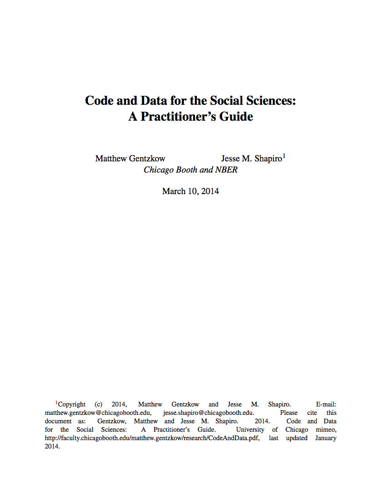
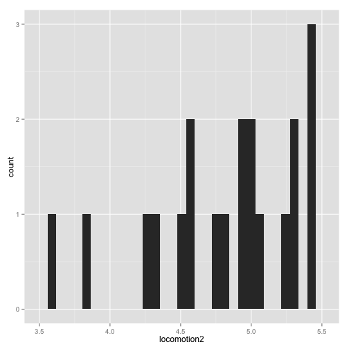
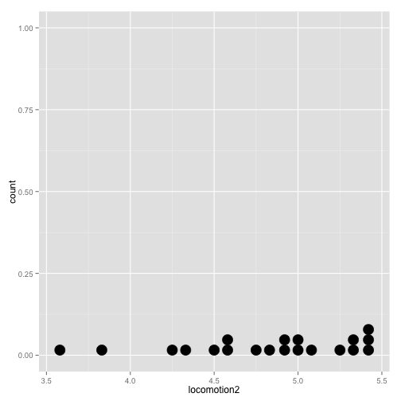
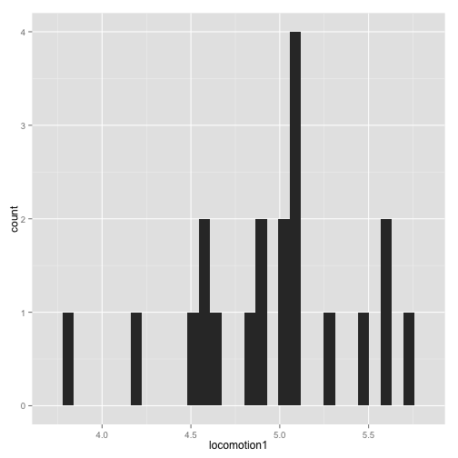
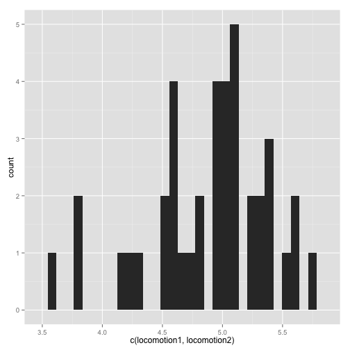

Stats workshop  
========================================================
author: Travis Riddle
date: 11/25/14

Strategy
========================================================

Mark gave me his data  I'm going to:

- Load it
- Get a sense of what it is
- Make some preliminary visualizations

Material
========================================================

What does this cover, practically?

- Load data
- Variable/object types
- ggplot2
- Some data reshaping

A quick digression
========================================================

### Some have asked me about organization


- Check out this guide ->

***


Organization
========================================================

### Use github!

- Version control
- Easier to collaborate
- A new way for people to document their intellectual accomplishments?
- [My github site](https://github.com/riddlet)

***


Organization
========================================================

### Use R Markdown

- Embed code and images (i.e. plots) directly into a document which also contains prose
- Write out what you're doing and why
- Helps ensure that the whole thing runs from start to finish (and avoids confusing code!)
- It's only a short jump to writing the actual paper.
- Plus, it makes really beautiful documents.  =)
- [Like this one](session_1.html)

One more underappreciated point
========================================================

You will (and should) spend a long time moving data around, and figuring out how to access subsets.  T-tests, anovas, regressions, etc., are only a very small part of what we do, and typically don't come until after a lot of organization work.

(I had no idea!)

***


Mark's Data
========================================================

Before loading it in, we need to make sure everything is contained in the same directory, and that this is our current working directory (cwd).  

Session -> Set Working Directory -> To Source File Location

Mark's Data
========================================================

Read in the data and get some information:

*Note:  Some of the output will look messy because of the limitations of presentations.  See the document for better versions*


```r
breach <- read.csv('Data/breachmeans.csv')
dim(breach)
```

```
[1] 20 32
```

Mark's Data
========================================================

Names of our variables:


```r
names(breach)
```

```
 [1] "subj"           "locomotion1"    "locomotion2"    "difflocomotion"
 [5] "assessment1"    "assessment2"    "diffassessment" "promotion1"    
 [9] "promotion2"     "diffpromotion"  "prevention1"    "prevention2"   
[13] "diffprevention" "stress1"        "stress2"        "diffstress"    
[17] "flourishing"    "swls"           "lie2"           "lie1"          
[21] "diffLie"        "LxA1"           "LxA2"           "diffLxA"       
[25] "age"            "exp"            "apride"         "lpride"        
[29] "eom"            "rankindiv"      "rank21"         "averank"       
```

Mark's Data
========================================================

First five rows:


```r
head(breach)
```

```
  subj locomotion1 locomotion2 difflocomotion assessment1 assessment2
1    1        5.00        4.58        -0.4167        4.17        3.67
2    2        4.50        4.58         0.0833        4.25        3.92
3    3        5.25        4.83        -0.4167        4.00        4.00
4    4        4.83        5.00         0.1667        4.00        3.83
5    5        5.08        4.92        -0.1667        4.50        3.83
6    6        5.08        4.75        -0.3333        5.00        4.08
  diffassessment promotion1 promotion2 diffpromotion prevention1
1        -0.5000       3.50       4.00         0.500         1.8
2        -0.3333       4.00       4.17         0.167         2.2
3         0.0000       4.17       3.83        -0.333         1.0
4        -0.1667       4.00       4.50         0.500         2.2
5        -0.6667       4.83       4.83         0.000         3.4
6        -0.9167       4.00       4.33         0.333         2.4
  prevention2 diffprevention stress1 stress2 diffstress flourishing swls
1         2.2            0.4    1.62    1.50     -0.125        6.50  6.0
2         2.2            0.0    2.00    2.50      0.500        5.25  5.8
3         1.4            0.4    2.38    2.25     -0.125        6.25  6.2
4         2.0           -0.2    2.00    2.62      0.625        6.88  6.8
5         3.0           -0.4    2.00    2.00      0.000        6.25  6.2
6         2.2           -0.2    1.75    2.12      0.375        6.00  5.6
  lie2 lie1 diffLie LxA1 LxA2 diffLxA age exp apride lpride eom rankindiv
1 1.67 1.83  -0.167 25.0 21.0  -3.993  23   3     37     46  40        10
2 2.67 2.33   0.333 20.2 21.0   0.757  26   6     38     38  35         4
3 2.00 2.67  -0.667 27.6 23.4  -4.201  22   4     32     40  43         6
4 2.33 3.00  -0.667 23.4 25.0   1.639  26   2     40     46  42        16
5 1.83 1.83   0.000 25.8 24.2  -1.667  26   4     45     44  38         3
6 3.00 3.17  -0.167 25.8 22.6  -3.278  29   3     38     44  34         5
  rank21 averank
1   13.0   11.50
2    3.5    3.75
3    5.0    5.50
4   16.0   16.00
5    3.5    3.25
6    7.0    6.00
```

Mark's Data
========================================================

First five rows:


```r
summary(breach)
```

```
      subj        locomotion1    locomotion2   difflocomotion  
 Min.   : 1.00   Min.   :3.83   Min.   :3.58   Min.   :-1.750  
 1st Qu.: 5.75   1st Qu.:4.65   1st Qu.:4.56   1st Qu.:-0.354  
 Median :10.50   Median :5.00   Median :4.92   Median :-0.208  
 Mean   :10.50   Mean   :4.95   Mean   :4.82   Mean   :-0.133  
 3rd Qu.:15.25   3rd Qu.:5.12   3rd Qu.:5.27   3rd Qu.: 0.271  
 Max.   :20.00   Max.   :5.75   Max.   :5.42   Max.   : 0.500  
                                                               
  assessment1    assessment2   diffassessment     promotion1  
 Min.   :3.75   Min.   :3.50   Min.   :-1.333   Min.   :3.50  
 1st Qu.:4.00   1st Qu.:3.83   1st Qu.:-0.542   1st Qu.:3.83  
 Median :4.29   Median :3.92   Median :-0.333   Median :4.00  
 Mean   :4.35   Mean   :4.02   Mean   :-0.333   Mean   :4.06  
 3rd Qu.:4.54   3rd Qu.:4.12   3rd Qu.:-0.146   3rd Qu.:4.21  
 Max.   :5.17   Max.   :4.92   Max.   : 1.167   Max.   :4.83  
                                                              
   promotion2   diffpromotion      prevention1    prevention2 
 Min.   :3.17   Min.   :-0.8330   Min.   :1.00   Min.   :1.4  
 1st Qu.:3.83   1st Qu.:-0.3330   1st Qu.:2.20   1st Qu.:2.2  
 Median :4.00   Median : 0.0835   Median :2.60   Median :2.7  
 Mean   :4.04   Mean   :-0.0167   Mean   :2.53   Mean   :2.6  
 3rd Qu.:4.33   3rd Qu.: 0.3330   3rd Qu.:3.00   3rd Qu.:3.0  
 Max.   :4.83   Max.   : 0.5000   Max.   :3.80   Max.   :3.4  
                                                              
 diffprevention     stress1        stress2       diffstress     
 Min.   :-0.80   Min.   :1.38   Min.   :1.00   Min.   :-0.7500  
 1st Qu.:-0.25   1st Qu.:1.69   1st Qu.:1.72   1st Qu.:-0.1250  
 Median : 0.20   Median :1.88   Median :2.00   Median : 0.0000  
 Mean   : 0.07   Mean   :2.01   Mean   :2.07   Mean   : 0.0855  
 3rd Qu.: 0.40   3rd Qu.:2.25   3rd Qu.:2.53   3rd Qu.: 0.3750  
 Max.   : 0.80   Max.   :3.50   Max.   :3.12   Max.   : 0.6250  
                 NA's   :1                     NA's   :1        
  flourishing        swls           lie2           lie1     
 Min.   :4.88   Min.   :4.40   Min.   :1.00   Min.   :1.00  
 1st Qu.:5.75   1st Qu.:5.75   1st Qu.:2.29   1st Qu.:2.29  
 Median :6.00   Median :5.80   Median :2.67   Median :2.50  
 Mean   :5.98   Mean   :5.91   Mean   :2.68   Mean   :2.63  
 3rd Qu.:6.25   3rd Qu.:6.20   3rd Qu.:3.04   3rd Qu.:3.00  
 Max.   :7.00   Max.   :7.00   Max.   :4.67   Max.   :4.50  
                                                            
    diffLie             LxA1           LxA2         diffLxA      
 Min.   :-0.6670   Min.   :14.7   Min.   :12.8   Min.   :-16.48  
 1st Qu.:-0.2085   1st Qu.:21.6   1st Qu.:20.8   1st Qu.: -3.79  
 Median : 0.0000   Median :25.0   Median :24.2   Median : -1.76  
 Mean   : 0.0416   Mean   :24.7   Mean   :23.5   Mean   : -1.26  
 3rd Qu.: 0.2085   3rd Qu.:26.2   3rd Qu.:27.8   3rd Qu.:  2.67  
 Max.   : 1.0000   Max.   :33.1   Max.   :29.3   Max.   :  5.17  
                                                                 
      age            exp           apride         lpride    
 Min.   :21.0   Min.   :0.00   Min.   :28.0   Min.   :29.0  
 1st Qu.:24.0   1st Qu.:2.00   1st Qu.:36.0   1st Qu.:38.0  
 Median :26.0   Median :3.00   Median :38.0   Median :41.5  
 Mean   :25.9   Mean   :3.25   Mean   :37.5   Mean   :41.4  
 3rd Qu.:28.0   3rd Qu.:4.00   3rd Qu.:39.0   3rd Qu.:46.0  
 Max.   :31.0   Max.   :8.00   Max.   :46.0   Max.   :49.0  
                                                            
      eom         rankindiv         rank21         averank     
 Min.   :34.0   Min.   : 1.00   Min.   : 1.00   Min.   : 1.50  
 1st Qu.:37.0   1st Qu.: 5.75   1st Qu.: 5.75   1st Qu.: 5.88  
 Median :38.5   Median :10.50   Median :11.00   Median :10.50  
 Mean   :38.5   Mean   :10.50   Mean   :11.00   Mean   :10.75  
 3rd Qu.:40.0   3rd Qu.:15.25   3rd Qu.:16.25   3rd Qu.:16.50  
 Max.   :43.0   Max.   :20.00   Max.   :21.00   Max.   :20.00  
                                                               
```

Mark's Data
========================================================

Get the structure:


```r
str(breach)
```

```
'data.frame':	20 obs. of  32 variables:
 $ subj          : int  1 2 3 4 5 6 7 8 9 10 ...
 $ locomotion1   : num  5 4.5 5.25 4.83 5.08 5.08 4.67 5 5.58 5.08 ...
 $ locomotion2   : num  4.58 4.58 4.83 5 4.92 4.75 5.08 4.33 5.25 5.33 ...
 $ difflocomotion: num  -0.4167 0.0833 -0.4167 0.1667 -0.1667 ...
 $ assessment1   : num  4.17 4.25 4 4 4.5 5 4 4.5 4.42 4.25 ...
 $ assessment2   : num  3.67 3.92 4 3.83 3.83 4.08 3.5 4 3.67 3.92 ...
 $ diffassessment: num  -0.5 -0.333 0 -0.167 -0.667 ...
 $ promotion1    : num  3.5 4 4.17 4 4.83 4 3.83 3.83 4 4.67 ...
 $ promotion2    : num  4 4.17 3.83 4.5 4.83 4.33 4.17 3.5 3.83 4 ...
 $ diffpromotion : num  0.5 0.167 -0.333 0.5 0 0.333 0.333 -0.333 -0.167 -0.667 ...
 $ prevention1   : num  1.8 2.2 1 2.2 3.4 2.4 2.8 3 2.8 2.6 ...
 $ prevention2   : num  2.2 2.2 1.4 2 3 2.2 3 2.8 3.2 2.8 ...
 $ diffprevention: num  0.4 0 0.4 -0.2 -0.4 -0.2 0.2 -0.2 0.4 0.2 ...
 $ stress1       : num  1.62 2 2.38 2 2 1.75 3.5 2.25 1.75 1.75 ...
 $ stress2       : num  1.5 2.5 2.25 2.62 2 2.12 3.12 2.88 1.75 1.75 ...
 $ diffstress    : num  -0.125 0.5 -0.125 0.625 0 0.375 -0.375 0.625 0 0 ...
 $ flourishing   : num  6.5 5.25 6.25 6.88 6.25 6 7 6 5.75 6 ...
 $ swls          : num  6 5.8 6.2 6.8 6.2 5.6 7 5.8 5.8 5.8 ...
 $ lie2          : num  1.67 2.67 2 2.33 1.83 3 4.67 2.33 1 3.17 ...
 $ lie1          : num  1.83 2.33 2.67 3 1.83 3.17 3.83 2.33 1 2.83 ...
 $ diffLie       : num  -0.167 0.333 -0.667 -0.667 0 -0.167 0.833 0 0 0.333 ...
 $ LxA1          : num  25 20.2 27.6 23.4 25.8 25.8 21.8 25 31.2 25.8 ...
 $ LxA2          : num  21 21 23.4 25 24.2 22.6 25.8 18.8 27.6 28.4 ...
 $ diffLxA       : num  -3.993 0.757 -4.201 1.639 -1.667 ...
 $ age           : int  23 26 22 26 26 29 28 24 27 22 ...
 $ exp           : int  3 6 4 2 4 3 0 3 4 1 ...
 $ apride        : int  37 38 32 40 45 38 38 33 36 37 ...
 $ lpride        : int  46 38 40 46 44 44 49 40 38 38 ...
 $ eom           : int  40 35 43 42 38 34 39 41 38 37 ...
 $ rankindiv     : int  10 4 6 16 3 5 12 9 11 19 ...
 $ rank21        : num  13 3.5 5 16 3.5 7 21 10 8 15 ...
 $ averank       : num  11.5 3.75 5.5 16 3.25 6 16.5 9.5 9.5 17 ...
```

Question
========================================================
1.  We wont always be fortunate enough to have .csv files.  Do you know how to read in excel files?  Spss files?  STATA?  Word?

Question
========================================================
1.  We wont always be fortunate enough to have .csv files.  Do you know how to read in excel files?  Spss files?  STATA?  Word?

```
library(xlsx)
read.xlsx()
library(foreign)
read.spss()
read.dta()
```
Microsoft word is possible (everything is *possible*), but a bit more complicated (see `tm` package)  

Data types
========================================================

- Sometimes, the difference in type doesn't matter.  Often, however, it does  
- We previously saw that mark had basically two types of variables:  `numeric` and `integer`  
 - i.e. quantitative variables  
- Psychologists also will deal with `factor` and `character` types  
  - `factor` is a categorical variable  
  - `character` is a text string (but remember text can also be numbers!)  
  
Data types
========================================================

Create a new variable indicating whether someone is happy:


```r
breach$happy <- rep(c("yes", "no"), each=10)
breach$happy #there's only 20 observations, so we can just print out all of them.
```

```
 [1] "yes" "yes" "yes" "yes" "yes" "yes" "yes" "yes" "yes" "yes" "no" 
[12] "no"  "no"  "no"  "no"  "no"  "no"  "no"  "no"  "no" 
```

```r
str(breach$happy)
```

```
 chr [1:20] "yes" "yes" "yes" "yes" "yes" "yes" "yes" ...
```

Data types
========================================================


```r
summary(breach$happy)
```

```
   Length     Class      Mode 
       20 character character 
```

- `Character` variable?
  - Just because we fed it a collection of text strings
  - Probably more accurately described as a categorical variable (thus, `factor`)
  
Data types
========================================================


```r
breach$happy <- as.factor(breach$happy)
breach$happy 
```

```
 [1] yes yes yes yes yes yes yes yes yes yes no  no  no  no  no  no  no 
[18] no  no  no 
Levels: no yes
```

```r
str(breach$happy)
```

```
 Factor w/ 2 levels "no","yes": 2 2 2 2 2 2 2 2 2 2 ...
```

```r
summary(breach$happy)
```

```
 no yes 
 10  10 
```

Data types
========================================================


```r
summary(breach$happy)
```

```
 no yes 
 10  10 
```

Calling the same function (e.g. `summary`) on the same data can lead to different outputs depending on how that data is *stored and represented*

Questions
========================================================

Let's say Mark ran a study in which his participants recieved 2, 4, or 8 'happy' primes.  We create a factor     variable which distinguishes these groups:
  
    `a <- as.factor(rep(c(2,4,8), each=10))`
  
For some purposes, this will be fine.  But let's say for some reason we want to treat this as a numeric value rather than a factor.  We run the following command:
  
    `a <- as.numeric(a)`
  
What happened?  Did it work as you expected?

Questions
========================================================

How are factor variables represented internally in R (*hint*:  Why, when we call `str(breach$happy)`, do we get a bunch of numbers)?  What's the logic behind their representation?
  
ggplot
========================================================

Now that I know a bit more about Mark's data, the typical next step would be to create some visualizations to see if I can find any obvious funny business.

Also, interesting patterns.

**Note:** *No hypothesis testing yet!  Look at data!  Spend a lot of time looking at data!*

ggplot
========================================================

- Lots of Mark's variables have two instances.  
- Time 1 and time 2?
- Any change?

ggplot
========================================================


```r
library(ggplot2)
plot <- ggplot(breach, aes(x=locomotion1))
plot + geom_histogram()
```

 

ggplot
========================================================


```r
plot <- ggplot(breach, aes(x=locomotion2))
plot + geom_histogram()
```

 

ggplot
========================================================

What's going on?

`plot <- ggplot(breach, aes(x=locomotion2))`

Object?  Data?

ggplot
========================================================

Next line:

`plot + geom_histogram()`

*empty plot + layer*

ggplot
========================================================

A different kind of layer:


```r
plot + geom_dotplot()
```

 

ggplot
========================================================

These plots aren't really ideal.

***
Why?


ggplot
========================================================

1.  Having two separate plots forces us to shift our eyes back and forth between the two.  It would be much better if they were plotted together.

2.  The sparsity of our data leads our histogram to be not-very-smooth.  Kind of chunky looking.  I love chunky peanut butter, but histograms, not so much.

ggplot
========================================================

The fix?

Plot both variables on the same object.  Let them overlap.  Somehow make it smoother?  A different geom type?

So, two variables on X?  Like this?

    `plot <- ggplot(breach, aes(x=c(locomotion1, locomotion2)))`
    
ggplot
========================================================


```r
plot <- ggplot(breach, aes(x=c(locomotion1, locomotion2)))
plot + geom_histogram()
```

 

Eh.  No.

ggplot
========================================================

We can pass an argument to ggplot which tells it to separate things by some group.  We can give them different colors: 

    `plot <- ggplot(breach, aes(x=*all.locomotion.scores*, color=*some.grouping.variable*))`
    
or different fills:

    `plot <- ggplot(breach, aes(x=*all.locomotion.scores*, fill=*some.grouping.variable*))`

or just let R decide what it thinks is best

    `plot <- ggplot(breach, aes(x=*all.locomotion.scores*, group=*some.grouping.variable*))`

ggplot
========================================================

So, we need to move things around.  We need:

Two vectors:
  - Vector 1 = all the values to be plotted on the x axis
  - Vector 2 = Which group each value in vector 1 belongs to.

To be absolutely concrete, for Mark's data, we're looking for all the locomotion scores to be in vector 1, and vector two to indicate whether each corresponding value in vector 1 is from **time 1** or **time 2**.

Questions
========================================================
There are other reasons we might not like the plots we just produced.  For example, maybe we want the bins into which the observations are sorted to be a bit larger.  Can you do this?  What setting do you think produces the best visualization for the data? (*hint*: `?geom_histogram`)

Questions
========================================================
In the last plot, the x axis label is horrible.  Change it to something more appropriate. You might find [this](http://docs.ggplot2.org/current/) helpful.

Reshaping
========================================================
To obtain the figures we want (and for many other things we might want to do), we need to rearrange mark's data.

It is currently in a *wide* format, and we need it to be in a *long* format.

We can use the `reshape2` package.

Reshaping
========================================================
Two main functions in `reshape2`:

To get data from wide to long, we use `melt`

To go from long to wide, we can use one of several versions of `cast`

Reshaping
========================================================

```r
library(reshape2)
breach <- melt(breach, 
     id.vars = c('subj', 'flourishing', 'swls', 'age', 'exp', 'apride', 
                 'lpride', 'eom', 'rankindiv', 'rank21', 'averank'),
     measure.vars = c('locomotion1', 'locomotion2', 'assessment1', 'assessment2', 
                      'promotion1', 'promotion2', 'prevention1', 'prevention2', 
                      'stress1', 'stress2', 'lie2', 'lie1', 'LxA1', 'LxA2'))
```

Reshaping
========================================================

```r
str(breach)
```

```
'data.frame':	280 obs. of  13 variables:
 $ subj       : int  1 2 3 4 5 6 7 8 9 10 ...
 $ flourishing: num  6.5 5.25 6.25 6.88 6.25 6 7 6 5.75 6 ...
 $ swls       : num  6 5.8 6.2 6.8 6.2 5.6 7 5.8 5.8 5.8 ...
 $ age        : int  23 26 22 26 26 29 28 24 27 22 ...
 $ exp        : int  3 6 4 2 4 3 0 3 4 1 ...
 $ apride     : int  37 38 32 40 45 38 38 33 36 37 ...
 $ lpride     : int  46 38 40 46 44 44 49 40 38 38 ...
 $ eom        : int  40 35 43 42 38 34 39 41 38 37 ...
 $ rankindiv  : int  10 4 6 16 3 5 12 9 11 19 ...
 $ rank21     : num  13 3.5 5 16 3.5 7 21 10 8 15 ...
 $ averank    : num  11.5 3.75 5.5 16 3.25 6 16.5 9.5 9.5 17 ...
 $ variable   : Factor w/ 14 levels "locomotion1",..: 1 1 1 1 1 1 1 1 1 1 ...
 $ value      : num  5 4.5 5.25 4.83 5.08 5.08 4.67 5 5.58 5.08 ...
```

Reshaping
========================================================

```r
summary(breach)
```

```
      subj        flourishing        swls           age      
 Min.   : 1.00   Min.   :4.88   Min.   :4.40   Min.   :21.0  
 1st Qu.: 5.75   1st Qu.:5.75   1st Qu.:5.75   1st Qu.:24.0  
 Median :10.50   Median :6.00   Median :5.80   Median :26.0  
 Mean   :10.50   Mean   :5.98   Mean   :5.91   Mean   :25.9  
 3rd Qu.:15.25   3rd Qu.:6.25   3rd Qu.:6.20   3rd Qu.:28.0  
 Max.   :20.00   Max.   :7.00   Max.   :7.00   Max.   :31.0  
                                                             
      exp           apride         lpride          eom      
 Min.   :0.00   Min.   :28.0   Min.   :29.0   Min.   :34.0  
 1st Qu.:2.00   1st Qu.:36.0   1st Qu.:38.0   1st Qu.:37.0  
 Median :3.00   Median :38.0   Median :41.5   Median :38.5  
 Mean   :3.25   Mean   :37.5   Mean   :41.4   Mean   :38.5  
 3rd Qu.:4.00   3rd Qu.:39.0   3rd Qu.:46.0   3rd Qu.:40.0  
 Max.   :8.00   Max.   :46.0   Max.   :49.0   Max.   :43.0  
                                                            
   rankindiv         rank21         averank             variable  
 Min.   : 1.00   Min.   : 1.00   Min.   : 1.50   locomotion1: 20  
 1st Qu.: 5.75   1st Qu.: 5.75   1st Qu.: 5.88   locomotion2: 20  
 Median :10.50   Median :11.00   Median :10.50   assessment1: 20  
 Mean   :10.50   Mean   :11.00   Mean   :10.75   assessment2: 20  
 3rd Qu.:15.25   3rd Qu.:16.25   3rd Qu.:16.50   promotion1 : 20  
 Max.   :20.00   Max.   :21.00   Max.   :20.00   promotion2 : 20  
                                                 (Other)    :160  
     value      
 Min.   : 1.00  
 1st Qu.: 2.60  
 Median : 3.83  
 Mean   : 6.37  
 3rd Qu.: 4.83  
 Max.   :33.10  
 NA's   :1      
```

Reshaping
========================================================
We went from 20 observations of 32 variables to 280 observations of 13 variables.  How?  Let's look at what happened:

Step one:  Feed it the data

    `breach <- melt(breach,`

Reshaping
========================================================
Step 2:  specify the identifying variables.  In a psych study, these are typically the things which *remain constant for a given subject*

    `id.vars = c('subj', 'flourishing', 'swls', 'age', 'exp', 'apride', 'lpride', 'eom', 'rankindiv', 'rank21', 'averank'),`

Reshaping
========================================================
Step 3:  specify the measured variables.  In a psych study, these are typically the things which *will vary within a subject*

    `measure.vars = c('locomotion1', 'locomotion2', 'assessment1', 'assessment2', 'promotion1', 'promotion2', 'prevention1', 'prevention2', 'stress1', 'stress2', 'lie2', 'lie1', 'LxA1', 'LxA2'))`
    
Reshaping
========================================================
In our new dataframe, everything that we put into 'measure.vars' has been turned into two vectors.  One identifies which column a particular observation come from, and the second gives the value of that observation.


```r
breach[breach$subj == 2,]
```

```
    subj flourishing swls age exp apride lpride eom rankindiv rank21
2      2        5.25  5.8  26   6     38     38  35         4    3.5
22     2        5.25  5.8  26   6     38     38  35         4    3.5
42     2        5.25  5.8  26   6     38     38  35         4    3.5
62     2        5.25  5.8  26   6     38     38  35         4    3.5
82     2        5.25  5.8  26   6     38     38  35         4    3.5
102    2        5.25  5.8  26   6     38     38  35         4    3.5
122    2        5.25  5.8  26   6     38     38  35         4    3.5
142    2        5.25  5.8  26   6     38     38  35         4    3.5
162    2        5.25  5.8  26   6     38     38  35         4    3.5
182    2        5.25  5.8  26   6     38     38  35         4    3.5
202    2        5.25  5.8  26   6     38     38  35         4    3.5
222    2        5.25  5.8  26   6     38     38  35         4    3.5
242    2        5.25  5.8  26   6     38     38  35         4    3.5
262    2        5.25  5.8  26   6     38     38  35         4    3.5
    averank    variable value
2      3.75 locomotion1  4.50
22     3.75 locomotion2  4.58
42     3.75 assessment1  4.25
62     3.75 assessment2  3.92
82     3.75  promotion1  4.00
102    3.75  promotion2  4.17
122    3.75 prevention1  2.20
142    3.75 prevention2  2.20
162    3.75     stress1  2.00
182    3.75     stress2  2.50
202    3.75        lie2  2.67
222    3.75        lie1  2.33
242    3.75        LxA1 20.20
262    3.75        LxA2 21.00
```

Reshaping
========================================================
In short, each variable we feed into `measure.vars` now has its own row for each subject.  So, since we fed in 14 variables, each subject now has 14 rows of data.

14 rows per subject * 20 subjects = 280 total rows


```r
dim(breach)
```

```
[1] 280  13
```
